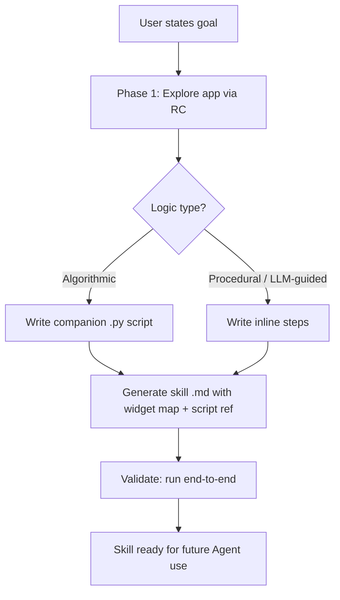

# SlateBot Scripting

> # 🛑 STOP.  READ THIS FIRST. 🛑
> **You are a BLACK‑BOX agent.**  You have NO access to the target
> application's source code.  You may NOT read files from disk, search
> file contents, explore directory trees, or delegate exploration to
> sub‑agents — if the data comes from a `.py`, `.cpp`, `.h`, `.uasset`,
> or markup/blueprint file belonging to the target app, it is OFF LIMITS.
> **All discovery MUST happen through RemoteControl HTTP APIs.**
> Scroll to [LAW #1](#-law-1-blackbox-only--violation--invalid-skill-) for the full rules.

Treat any UE5 UMG application as a **black box** and drive it
programmatically through SlateBot + RemoteControl.  The workflow has
three phases: **explore** the application to understand its widgets
and interactions, **generate** a reusable automation skill, and when
necessary **extend** the SlateBot mechanism itself.

This skill focuses on **using** applications — clicking buttons, reading
displays, filling forms, navigating menus.  Testing is one use case among
many; the same tools also power bots, solvers, macro recorders, data
extractors, and any workflow that needs to interact with a UE5 UI without
a human at the keyboard.

---

## ⛔⛔⛔ LAW #0: NO EXPLORATION = NO OUTPUT ⛔⛔⛔

> **You MAY NOT write a single line of skill output until you have
> personally called RemoteControl APIs and received real responses.**

This is not about source code — it's about **evidence**.  Every fact in
your generated skill (widget paths, colour thresholds, delegate types,
grid dimensions) MUST come from a RemoteControl API response that **you
personally observed**.  Domain knowledge ("Minesweeper has a 9×9 grid"),
documentation, and inference from other skills are NOT substitutes.

### 🛑 THE HARD GATE — you may NOT proceed to Phase 2 until ALL of these are true:

| # | Requirement | How to satisfy |
|---|-------------|----------------|
| 1 | The target app is **running** in the UE5 editor | User confirms, or `GetSlateBotInstances()` returns the instance |
| 2 | You have called `GetWidgetTreeDiff` and received a **non‑empty** response | The response contains actual `WidgetPath` strings, not `[]` |
| 3 | You have identified every interactive widget's **exact** path from the diff | Extracted from `WidgetPath` fields — NOT guessed, NOT copied from another skill |
| 4 | You have read at least one **observable state property** (`Text`, `BrushColor`, `Visibility`) from each key widget | From `GetWidgetTreeDiff` `Properties` or `/remote/object/property` fallback |
| 5 | You have sent at least one `SendClick` and **observed the resulting state change** via a follow‑up diff | Clicks that return `bSuccess: True` but produce no observable change do NOT count — troubleshoot first |
| 6 | You have classified all distinct visual states (hidden/revealed/flagged/etc.) from **actual colour values** in the diff | Colour thresholds calibrated from real API responses, not assumed |

### 🛑 If the app is NOT running:

**STOP immediately.**  Do NOT write any skill files.  Do NOT "sketch" a
script.  Do NOT output widget paths you remember from a prior session.

Ask the user:
> "Please launch the target app in the UE5 editor so I can explore it
> via RemoteControl.  I cannot generate the skill without live API responses."

Wait for the user to confirm the app is running, then begin exploration.

### 🛑 SELF‑CHECK — Before writing ANY skill output (SKILL.md, .py, etc.):

```
Did I personally call GetWidgetTreeDiff and receive a real response?
  NO  → ABORT.  Ask the user to launch the app.  DO NOT generate output.
  YES → Check: are the widget paths in my output from that response?
         NO  → ABORT.  Rewrite using only observed data.
         YES → Proceed to Phase 2 generation.
```

### 🛑 FORBIDDEN SHORTCUTS

| ❌ NEVER do this | ✅ Do this instead |
|-------------------|-------------------|
| Write a skill from domain knowledge without calling any API | Ask user to launch the app; explore via `GetWidgetTreeDiff` first |
| Copy widget paths from another skill's documentation or examples | Call `GetWidgetTreeDiff` and extract paths from the live response |
| Assume colour thresholds from a previous session | Re‑calibrate from the current session's diff values |
| Guess grid dimensions from common knowledge | Count children of the grid container in the diff |
| Write a "template" script to refine later | Exploration MUST happen first — no output before evidence |

---

## ⛔⛔⛔ LAW #1: BLACK‑BOX ONLY — VIOLATION = INVALID SKILL ⛔⛔⛔

> **This is not a guideline.  It is the fundamental law of this skill.
> A skill generated after reading application source code is VOID.**

The Agent is a **remote observer** that can ONLY see widget properties
and send input events — exactly like a human user who can only see the
screen and click.  ALL discovery MUST happen through RemoteControl HTTP
APIs (`GetWidgetTreeDiff`, `GetSlateBotInstances`,
`/remote/object/property`, `/remote/object/describe`, `SendClick`, etc.).

### 🛑 SELF‑CHECK — Before EVERY tool call, ask:

```
Does this tool call read application source code?
  YES → ABORT.  Use RemoteControl instead.
  NO  → Proceed.
```

"Application source code" means ANY file that is part of the target
app, regardless of language or format:

| ❌ FORBIDDEN file types | Examples |
|--------------------------|----------|
| `.py` Python source | Any `.py` file that implements the target app's logic, UI components, or data model |
| `.cpp` / `.h` C++ source | Any C++ file under the target app's Source/ directory |
| `.uasset` / `.umap` | Any binary Unreal asset of the target app (includes Blueprints) |
| Markup / declarative UI files | Any file that defines the target app's widget tree or layout (XML, JSON, etc.) |
| `.json` dumps | Unless they are verified RemoteControl API responses |

### 🛑 FORBIDDEN ACTIONS (regardless of what tools you have)

| ❌ Action category | Description |
|--------------------|-------------|
| **Read files from disk** | Opening, reading, or displaying the contents of any file that belongs to the target application |
| **Search file contents** | Searching for class names, event names, constants, or game rules inside the target app's source tree |
| **List / explore directories** | Discovering the target app's file structure, enumerating source files, or walking its directory tree |
| **Delegate to sub‑agents** | Asking a sub‑agent to explore, read, or analyze the target app's source code |
| **Fetch external docs** | Retrieving documentation that describes the specific target app's internal implementation |

> **Self‑check:** if a tool call would reveal information about the target
> app that a human user could NOT obtain by looking at the screen and
> clicking, it is forbidden.  RemoteControl APIs are your ONLY window
> into the app.

### 🛑 FORBIDDEN WORKFLOWS

| ❌ NEVER do this | ✅ Do this instead |
|-------------------|-------------------|
| Read the app's Python files to learn grid size or game rules | Call `GetWidgetTreeDiff`, count widget nodes; ask the user for the domain |
| Read the app's component files to learn visual states | Read `Text` + `BrushColor` on each widget via diff |
| Search source for constants (`ROWS =`, `MINES =`, etc.) | Observe initial values of status/counter widgets; count interactive elements |
| Read declarative UI files to learn widget names | `GetWidgetTreeDiff` → inspect `WidgetPath` fields |
| Read source to discover event handler names | `GetWidgetTreeDiff` → inspect `Delegates` array |
| Delegate exploration to a sub‑agent | Call `GetSlateBotInstances()` + `GetWidgetTreeDiff` yourself |
| Read source "just to save time" on exploration | There is NO shortcut.  Exploration IS the workflow. |

### ✅ What the Agent MAY do

- Call RemoteControl APIs to read widget properties and send input.
- Write Python automation scripts that call RemoteControl APIs.
- Write JSONL log output from those scripts.
- Reason about observed behaviour to infer application rules.
- Ask the user when the black‑box observation is insufficient.
- Read files under `Skills/slatebot-scripting/` (the skill itself).
- Read files under a generated skill's own directory (`.github/skills/automate-<slug>/`).
- Read SlateBot C++ plugin source (`Game/Plugins/SlateBot/Source/`) — this is the
  **automation framework**, NOT the target application.

### Why this matters

Reading source code defeats the purpose of black‑box testing.  The
entire point is to verify the application works correctly from the
**outside** — through the same interfaces a real user or external
tool would use.  If the Agent reads the source, it may unconsciously
depend on implementation details that are invisible to real users,
making the tests fragile and missing real bugs.

> **If you find yourself wanting to read a source file, STOP.**
> Instead, ask: "What RemoteControl call would give me this
> information?"  If no such call exists, that is itself a finding —
> the application has an observability gap.  Report it to the user.

---

## Agent workflow (quick start)

> # ⚠️ BEFORE YOU DO ANYTHING ⚠️
> 1. Read [LAW #0](#-law-0-no-exploration--no-output-) — you MAY NOT
>    write skill output without first exploring via RemoteControl.
> 2. Read [LAW #1](#-law-1-blackbox-only--violation--invalid-skill-) —
>    you MAY NOT read target‑app source code.

When a user gives you an automation goal, follow this sequence.  After
each step, report your findings briefly — don't wait until the end.

| Step | What | Detailed guide |
|------|------|---------------|
| **1. Clarify domain** | Ask the user what kind of app this is | *(below)* |
| **2. Explore** 🛑 | Probe the running app via RemoteControl APIs | [Phase 1](#phase-1----exploration-agentled) |
| **3. Confirm** | Present widget map + behaviour model to user | *(below)* |
| **4. Generate** | Write `SKILL.md` + companion `.py` scripts to `.github/skills/automate-<slug>/` | [Phase 2](#phase-2----generate-an-automation-skill) |
| **5. Validate** | Run end‑to‑end at least once | [Troubleshooting](#troubleshooting) |
| **6. Report** | Tell user: what was generated, the full `.github/skills/automate-<slug>/` path, and the result | *(below)* |

> 🛑 **Step 2 is a HARD GATE.**  Satisfy ALL 6 requirements in
> [LAW #0's checklist](#-the-hard-gate--you-may-not-proceed-to-phase-2-until-all-of-these-are-true)
> before moving to Step 3.  If the app is not running, STOP and ask
> the user to launch it.  Do NOT generate any files until exploration
> is complete.
>
> 🛑 **Step 4 pre‑check:** Before creating any file, verify:
> 1. You personally called `GetWidgetTreeDiff` and received real responses
>    in THIS session.  See [LAW #0's self‑check](#-selfcheck--before-writing-any-skill-output-skillmd-py-etc).
> 2. You are creating files under **`.github/skills/automate-<slug>/`** —
>    NOT inside the SlateBot plugin, NOT in a temp directory, NOT anywhere
>    else.  This is the standard VS Code Copilot workspace‑skill discovery
>    path.  Skills created elsewhere will not be found by future Agents.

---

## Phase 1  -- Exploration (Agent‑led)

Before writing any automation, the Agent interacts with the running application
to build a mental model of the UI.  This phase is **conversational and
ad‑hoc**  -- the Agent probes, observes, and experiments.

> **🔴 BLACK‑BOX ONLY:** All discovery in this phase happens through
> RemoteControl HTTP calls.  The Agent MUST NOT read source files
> (`.py`, `.cpp`, `.h`, `.uasset`, blueprint assets, declarative UI
> markup) to learn about the application.  Widget names, grid sizes,
> game rules, event bindings — everything is discovered through
> `GetWidgetTreeDiff`, property reads, and click‑and‑observe
> experiments.  See
> [LAW #1](#-law-1-blackbox-only--violation--invalid-skill-)
> above for the complete forbidden/allowed list.

### What to discover

The discovery is a two‑layer process: **domain knowledge** (what you already
know from the user) plus **black‑box observation** (what you measure via
RemoteControl).

**Layer 1 — Domain knowledge (ask the user, then apply common sense)**

Before probing, ask the user what kind of application this is.  Their
answer gives you the **domain model** — the concepts and rules that are
common knowledge for that application type, not implementation details:

- "A puzzle game" → numbers = adjacent mine count, right‑click = flag.
- "A registration form" → text fields expect user input, a Submit button
  sends the data.
- "A leaderboard" → rows represent ranked entries, columns are attributes.

This is **not** reading source code — it's domain literacy.  Use it to
interpret observations, not to skip them.  If you "know" the typical grid
size or mine count, still verify by experiment.  Domain knowledge tells
you *what the numbers mean*; observation tells you *what the numbers are*.

**Layer 2 — Black‑box observation (measure everything)**

| Question | How |
|----------|-----|
| What SlateBot instances exist? | `GetSlateBotInstances()` |
| What is the widget‑tree structure? | `GetWidgetTreeDiff` (first call = full tree + properties); see [Widget‑tree Diff API](#widget-tree-diff-api) |
| Which widgets are interactive? | Probe `bIsEnabled`, `Visibility` |
| What **events** are bound on each interactive widget? | `GetWidgetTreeDiff` returns a `Delegates` array per node (`FSlateBotDelegateInfo`: `bHasBindings`, `TypeName`); for delegate names use `/remote/object/describe` as fallback; see [Discovering widget events](#discovering-widget-events) |
| What does each widget display / control? | Read `Text`, `BrushColor`,  -- |
| Do clicks reach the right target? | `SendClick` against the widget; try both outer and `WidgetTree_0.<child>` paths |
| Do simulated clicks trigger the **expected handler**? | `SendClick` then **immediately** re‑read observable state (text, color, visibility) |
| Which visual changes are **automatic** vs. input‑driven? | Cross‑reference: a property that changes without any prior click is likely automatic (binding, tick, animation).  A property that consistently changes only after clicks is input‑driven.  Caveat: applications may have **randomness**  -- the same click may not produce identical results, and a change without input does not always imply determinism. |
| Are there edge cases (disabled states, animations, timing)? | Observe and experiment |

### Exploration loop

```
GetWidgetTreeDiff (baseline)  --  PROBE event bindings   --  CLICK   --  GetWidgetTreeDiff (changes)
      --                                                                        -- 
     └────── ASK the user when uncertain  ←───────────────────────────────── -- 
                               (ambiguity, confirmation)
```

The goal is to understand the application well enough to automate it, but
the Agent is **not forced to guess**.  When the mental model is unclear —
ambiguous widget behaviour, unexpected state transitions, non‑deterministic
outcomes — the Agent **asks the user** for clarification.  Before finalising
the automation artifact (Phase 2), the Agent can also present its findings
and proposed plan to the user for confirmation.

Key principles:

1. **Check delegate bindings before clicking.**  Use `GetWidgetTreeDiff` →
   `Delegates` array: `bHasBindings: true` means `SendClick` can trigger a
   handler.  If all delegates show `bHasBindings: false`, skip the widget —
   clicks are wasted.  See [Discovering widget events](#discovering-widget-events)
   for the full procedure.

2. **Distinguish automatic from input‑driven change.**  A property that
   changes without any prior click is likely automatic (binding, tick,
   animation).  A change that only ever appears after a specific click is
   input‑driven.  Caveat: applications may have **randomness** — the same
   click may not always reproduce the same result.

3. **Inspect ALL changed properties, not just the one you expect.**  After
   each batch of interactions, call `GetWidgetTreeDiff` and examine **every**
   `Property` on **every** changed node.  A single property can miss state
   transitions (e.g. a grid cell reveals with 0 adjacent items — `Text`
   stays `""` but `BrushColor` shifts).  Build the state model from the
   union of all changes.

4. **Iterate and ask when uncertain.**  Each observation narrows the model.
   If behaviour is ambiguous, pause and ask the user.  Before Phase 2,
   present the widget map, behaviour model, and automation plan for
   confirmation.

The Agent uses RemoteControl to call SlateBot functions and read widget
properties, building understanding step by step.  No script is written yet  -- 
this is pure discovery.

### Bootstrap procedure

When beginning exploration of a new application, follow these steps to avoid
operating on an uninitialised app:

1. **Discover the instance**  -- `GetSlateBotInstances()`, extract the prefix.
2. **Confirm the app is ready**  -- read a widget property that should show a
   stable initial value (e.g. a status label, a title, a counter at zero).
   Discover this baseline through RemoteControl, not by reading source.
   If it doesn't match, wait 0.5 s and retry up to 5 times.  This
   prevents false negatives from clicking before initialisation completes.
3. **Explore the widget tree**  -- `GetWidgetTreeDiff` fetches the full tree
   plus properties in one call.  The first call returns everything;
   subsequent calls return only changes automatically.
4. **Classify widgets**  -- read `Visibility` and `bIsEnabled` for each,
   labelling them as "interactive" / "display‑only" / "hidden".
5. **Inspect event bindings**  -- for interactive widgets, check the
   `Delegates` array in `GetWidgetTreeDiff` nodes to see which delegates
   have runtime bindings (`bHasBindings: true`).
6. **Verify experimentally**  -- `SendClick` widgets that have bound handlers,
   immediately re‑reading state to confirm the effect.

> **Step 2 is critical.**  Skipping it leads to wasted clicks and wrong
> conclusions.  In practice, an uninitialised app may still return valid
> widget paths and `bSuccess: True` from `SendClick`, but the handlers
> won't execute because the backing logic hasn't started yet.  Always
> confirm readiness by reading a **known‑value property** (e.g. a status
> label, a counter that should show a specific initial value).

---

## Phase 2  -- Generate an automation skill

Phase 1 produced a mental model of the application.  Phase 2 transforms
that model into a **reusable skill document** — a self‑contained `.md` file
that a future Agent (or the same Agent in a new session) can load and
execute without re‑exploring.

The generated skill MUST be created at **`.github/skills/automate-<slug>/`**
within the workspace root (standard VS Code Copilot workspace-skill
discovery path).  Companion Python scripts go in
`.github/skills/automate-<slug>/Scripts/`.  The skill references only
the SlateBot RemoteControl API — **no source code of the target
application.**

After completing Phase 1 exploration and receiving user confirmation,
decide the automation form:

- **Algorithmic logic** (scan → compute → click → repeat) → write a
  **Python companion script** in the skill's `Scripts/` subdirectory.
- **Intelligent decision‑making** (interpreting labels, adapting to
  layout changes) → write **inline step‑by‑step instructions** in the
  skill document.

Then create `.github/skills/automate-<slug>/SKILL.md` following the template below,
write companion scripts if needed, validate end‑to‑end, and report.

### Generated skill template

Every generated skill MUST contain these sections:

```markdown
# Automate: <one‑line goal description>

## Goal
<The user's goal in 1–2 sentences, as they stated it.>

## Prerequisites
- SlateBot instance: `<InstanceName>`
- Launch command: `<console command to open the app>`
- RemoteControl: `http://127.0.0.1:30010`
- Companion scripts: `<list of .py files in the skill's Scripts/ subdirectory>`

## Widget map (discovered at exploration time)
| Widget path pattern | UMG class | Role | Click target |
|---------------------|-----------|------|--------------|
| `...CounterDisplay` | `TextBlock` | Shows current count | ❌ (read only) |
| `...IncrementButton` | `Button` | Increases count | ✅ |
| `...ResetButton` | `Button` | Resets to initial state | ✅ |

> Re‑discover the transient prefix via `GetSlateBotInstances()` each run.
> Named widgets like `CounterDisplay` are stable; only the world prefix
> changes.
> For composite/custom widgets, target the internal child via
> `WidgetTree_0.<ChildName>` (see §2 in Best Practices).

## Application behavior model (discovered during exploration)

<Record the rules inferred from observation, enriched by domain knowledge.
This is what turns raw widget data into actionable automation logic.>

### State representation
- How does each logical state map to observable widget properties?
  (e.g. a disabled button → `bIsEnabled=false` + `RenderOpacity=0.5`;
   a selected row → `BrushColor` shifts from grey to blue;
   a cell in state "empty" vs "hidden" → both show `Text=""` but
   differ in `BrushColor.R`)
- Are there states that look identical in one property but differ
  in another?

### Interaction rules
- What happens when you click a widget in each state?
- Which changes are input‑driven vs automatic (cascade, animation, binding)?
- Any safety guarantees?  (e.g. the app prevents destructive actions on
  first interaction)

### Terminal conditions
- Observable signals for success, failure, or needing a restart.
- How to confirm the app is in a known clean state.

### Discovered parameters
- Grid dimensions, item counts, naming conventions.
- Calibrated colour thresholds for visual‑state classification.

## Automation procedure

### Step 1 — Launch & confirm ready
- Execute the launch command via `ExecuteConsoleCommand`.
- Poll `GetSlateBotInstances()` until `<InstanceName>` appears.
- Read a known widget property to confirm initialisation.

### Step 2 — Observe initial state
- Call `GetWidgetTreeDiff` (first call = full tree).
- Verify the expected widgets are present and interactive.

### Step 3 … N — Action loop
For each logical step:
- **Observe:** read the relevant widget properties.
- **Decide:** compute the next action from observed state.
- **Act:** `SendClick` / `SendKey` / `SendText`.
- **Verify:** re‑read state to confirm the action took effect.

If a companion Python script handles the loop, replace steps 3…N with:
- Run `python .github/skills/automate-<slug>/Scripts/<companion>.py <args>`.
- The script reads state, computes actions, and clicks autonomously.
- The skill verifies the final outcome.

## Edge cases & recovery
- What to do if a widget is not found or disabled.
- How to detect and recover from stuck states (see Best Practices §10).
- How to restart/retry.

## Success criteria
- Observable conditions that mean the goal was achieved.
- Observable conditions that mean the goal failed.
```

### Naming convention

| Goal | Skill directory | Script file (if any) |
|------|-----------------|----------------------|
| Fill counter to target | `.github/skills/automate-counter-fill/` | `.github/skills/automate-counter-fill/Scripts/counter_fill.py` |
| Fill registration form | `.github/skills/automate-registration-fill/` | *(inline steps, no script)* |
| Dump leaderboard to CSV | `.github/skills/automate-leaderboard-export/` | `.github/skills/automate-leaderboard-export/Scripts/leaderboard_export.py` |

### What the generated skill MUST capture

These are the minimum facts a future Agent needs — without them it would
have to re‑explore from scratch:

| Fact | Source in Phase 1 |
|------|-------------------|
| Instance name and launch command | `GetSlateBotInstances()` + user prompt |
| Widget paths for interactive elements | `GetWidgetTreeDiff` first call |
| Which delegates are bound (`bHasBindings: true`) | `GetWidgetTreeDiff` → `Delegates` array |
| Click target (outer vs `WidgetTree_0.<child>`) | Probe with `describe` + `Visibility` check |
| Observable state indicators (Text, BrushColor thresholds) | Calibration reads |
| Application behavior model (state mapping, interaction rules, terminal conditions) | Observation + domain knowledge from user |
| Restart/recovery widget paths | Widget tree exploration |

### Relationship to companion Python scripts

The generated skill is the **primary artifact**.  Companion scripts are
**optional helpers** that the skill invokes.  The skill MUST still contain
the widget map and enough context for a future Agent to understand what
the script does and to diagnose failures — the script is not a black box
within a black box.



---

## Technical reference

The sections below are shared by generated skills and companion scripts.
Use them when writing Python helpers or authoring automation skill documents.

### Widget‑tree Diff API

`GetWidgetTreeDiff(InstanceName)` is the primary entry point for exploration.

- **First call**: returns the full widget tree with every node's readable
  properties.
- **Subsequent calls**: returns only changed nodes + ancestors (`ParentPath`
  for tree reconstruction), with only the differing properties.
- The cache is updated automatically  -- returns an empty array when nothing
  changed.

```python
def get_tree_diff(instance_name):
    r = requests.put(f'{BASE}/remote/object/call', json={
        'objectPath': '/Script/SlateBot.Default__SlateBotFunctionLibrary',
        'functionName': 'GetWidgetTreeDiff',
        'parameters': {'InstanceName': instance_name},
    }, timeout=10)
    return r.json().get('ReturnValue', []) if r.status_code == 200 else []
```

`FSlateBotTreeNodeInfo` fields:

| Field | Meaning |
|-------|---------|
| `WidgetPath` | Object path |
| `ParentPath` | Parent object path (empty for root) |
| `WidgetClass` | UClass path, e.g. `"/Script/UMG.Border"` |
| `Properties` | Changed properties (`FSlateBotPropertyInfo`: `PropertyName`, `OldValue`, `NewValue`) |
| `Delegates` | Delegate binding status (`FSlateBotDelegateInfo`: `bHasBindings`, `TypeName`); populated on first call and for new widgets |

> Prefer `GetWidgetTreeDiff` over manual BFS with `GetChildrenCount` /
> `GetChildAt`  -- it fetches the full tree plus properties in one call
> and performs automatic incremental diffs on subsequent calls.

### Resetting the diff cache

`ResetWidgetTreeCache(InstanceName)` clears the internal snapshot for the
given instance.  The next `GetWidgetTreeDiff` call behaves as a **first call**
-- it returns the full tree with all properties and delegates populated.

Use this when:
- Starting a new automation run so the first diff is a clean baseline.
- Re‑running automation after the application state has been reset.
- The application closed and reopened, making the cached snapshot stale.

```python
def reset_cache(instance_name):
    requests.put(f'{BASE}/remote/object/call', json={
        'objectPath': '/Script/SlateBot.Default__SlateBotFunctionLibrary',
        'functionName': 'ResetWidgetTreeCache',
        'parameters': {'InstanceName': instance_name},
    }, timeout=5)
```

### Widget‑tree navigation (manual fallback)

`GetWidgetTreeDiff` covers most scenarios.  The following are supplementary
for manual traversal.

#### UMG object paths

Every UWidget has a stable object path:

```
/Engine/Transient.World_X:MyWidget_C_0.WidgetTree_0.MyButton
```

- The prefix (up to `WidgetTree_0`) comes from `GetSlateBotInstances()`.
- Append `.<WidgetName>` to reach any named widget.

#### Internal children of custom widgets

Custom widget components expose their internal tree through a
**`WidgetTree_0` suffix**:

```
{Prefix}.MyComponent.WidgetTree_0.MyBorder
{Prefix}.MyComponent.WidgetTree_0.MyLabel
```

> `GetChildrenCount()` / `GetChildAt()` may return 0 for dynamically‑created
> components.  Use the explicit `WidgetTree_0.<ChildName>` path instead.

#### Traversal helpers (UMG built‑ins)

| Function              | Works on        | Notes                       |
|-----------------------|-----------------|-----------------------------|
| `GetChildrenCount()`  | `UPanelWidget`  | Direct child count           |
| `GetChildAt(Index)`   | `UPanelWidget`  | Returns child UWidget path   |
| `GetText()`           | `UTextBlock`,  -- | Displayed text (may be `""`) |
| `GetAccessibleSummaryText()` | any      | Slate accessibility text     |

#### Named‑widget lookup

```python
def find_named(parent_path, name_fragment, max_depth=8):
    seen = {parent_path}
    queue = [parent_path]
    for _ in range(max_depth):
        for p in queue:
            if name_fragment in p:
                return p
            for child in get_children(p):
                if child not in seen:
                    seen.add(child)
                    queue.append(child)
    return None
```

### Reading widget state

**Prefer `GetWidgetTreeDiff`** as the primary state‑reading mechanism —
1 HTTP call instead of 162 for a 9×9 grid.  First call returns the full
tree; subsequent calls return incremental diffs.

#### Local state cache (persist to disk)

Since `GetWidgetTreeDiff` already provides all widget state, maintain a
**local cache** in your automation script that mirrors the last known
state of every widget.  The cache is rebuilt from the first
`GetWidgetTreeDiff` call and incrementally updated on subsequent diffs.
This means the script does **not** need to stay memory‑resident — you
can persist the cache to disk (JSON file) and reload it on the next run:

```python
import json, os

CACHE_FILE = 'widget_state_cache.json'

def load_cache():
    if os.path.exists(CACHE_FILE):
        with open(CACHE_FILE, 'r') as f:
            return json.load(f)
    return {}

def save_cache(cache):
    with open(CACHE_FILE, 'w') as f:
        json.dump(cache, f, indent=2)

def update_cache_from_diff(cache, diff_nodes):
    """Apply GetWidgetTreeDiff results to the local cache."""
    for node in diff_nodes:
        widget_path = node['WidgetPath']
        if widget_path not in cache:
            cache[widget_path] = {'class': node.get('WidgetClass', '')}
        for prop in node.get('Properties', []):
            cache[widget_path][prop['PropertyName']] = prop['NewValue']

def read_cached(cache, widget_path, property_name):
    """Read a property from the local cache (no HTTP call needed)."""
    return cache.get(widget_path, {}).get(property_name)
```

With a persistent cache, automation logic can be split across short‑lived
script invocations — each run loads the cache, computes the next action(s),
sends input, diffs the changes, updates the cache, and saves it back to disk.

Common readable properties (all equally trustworthy — they are UPROPERTY
values updated through the standard UMG data‑binding pipeline):

| Property          | Type             | Example                        |
|-------------------|------------------|--------------------------------|
| `Text`            | `FText`          | `"Hello"`                      |
| `BrushColor`      | `FLinearColor`   | `{"R":0.86,"G":0.86,"B":0.88}`|
| `ColorAndOpacity` | `FSlateColor`    | `{"R":1,"G":1,"B":1,"A":1}`   |
| `Visibility`      | `ESlateVisibility`| `"Visible"` / `"Hidden"`     |
| `bIsEnabled`      | `bool`           | `true`                         |
| `RenderOpacity`   | `float`          | `1.0`                          |

> **Empty‑reveal detection:** when a cell reveals with 0 adjacent
> items, `Text` stays `""` but `BrushColor` transitions (e.g.
> R≈0.72 → R≈0.86).  `GetWidgetTreeDiff` reports both; always
> inspect **all** changed properties.

> ⚠️ **GetWidgetTreeDiff value format differs from per‑property reads.**
> `/remote/object/property` returns struct values (BrushColor,
> ColorAndOpacity, etc.) as JSON objects:
> `{"R":0.86,"G":0.86,"B":0.88,"A":1.0}`.
> `GetWidgetTreeDiff` returns the same values as **strings**:
> `"(R=0.860000,G=0.860000,B=0.880000,A=1.000000)"`.
> You MUST parse both formats.  Use a helper that tries dict first,
> then falls back to regex extraction:
>
> ```python
> import re
> def parse_color(val):
>     if val is None:
>         return None
>     if isinstance(val, dict):
>         return {k: val.get(k, val.get(k.lower(), 0)) for k in ('R','G','B','A')}
>     if isinstance(val, str):
>         result = {}
>         for m in re.finditer(r'([RGBA])=([\d.]+)', val):
>             result[m.group(1)] = float(m.group(2))
>         return result if result else None
>     return None
> ```

#### Fallback: per‑property reads

When you only need a single property from a known widget, the
`/remote/object/property` endpoint is a direct fallback:

```python
def prop(obj_path, property_name):
    r = requests.put(f'{BASE}/remote/object/property',
                     json={'objectPath': obj_path, 'propertyName': property_name})
    if r.status_code != 200:
        return None
    data = r.json()
    # Key is the property name: {"Text": "Hello"}
    return data.get(property_name) if property_name in data else data.get('PropertyValue')
```

### Discovering widget events

Before sending input, determine **which events each widget can receive**.
This tells you what `SendClick` (and future input functions) can trigger.

#### How delegate info is exposed

`GetWidgetTreeDiff` returns a `Delegates` array on every tree node (on
the first call and for newly appeared widgets).  Each entry is an
`FSlateBotDelegateInfo` with two fields:

| Field | Meaning |
|---|---|
| `bHasBindings` | `true` when at least one function is bound at runtime |
| `TypeName` | C++ type name (`"FOnPointerEvent"`, `"FOnButtonClickedEvent"`, etc.) |

#### Workflow

1. Call `GetWidgetTreeDiff` on the first exploration round -- the full tree
   is returned with `Delegates` populated on every node.
2. For each interactive widget, inspect `Node.Delegates`.  Any entry with
   `bHasBindings: true` means a handler is attached and `SendClick` can
   trigger it.
3. If a widget has no delegate entries at all, use
   `/remote/object/describe` as a fallback to discover delegate property
   *names* (look for `FOn…` types), then re‑run `GetWidgetTreeDiff` after
   the widget is fully initialised.

> **Key point:** delegate binding status is available directly from
> `GetWidgetTreeDiff` -- no separate API call is needed.  The `Delegates`
> array is always present on nodes returned in the first diff (or when a
> new widget first appears).  On subsequent incremental diffs, unchanged
> ancestor nodes do not carry delegate info; use the first‑call data or
> call `ResetWidgetTreeCache` to force a full refresh.

#### Delegate type patterns

Common delegate types found on UMG widgets:

| Type pattern | Example properties | Fires when |
|---|---|---|
| `FOnPointerEvent` | `OnMouseButtonDownEvent`, `OnMouseButtonUpEvent`, `OnMouseMoveEvent` | Mouse interacts with the widget |
| `FOn…ClickedEvent` | `OnClicked` | Button click confirmed |
| `FOn…PressedEvent` | `OnPressed` | Button press starts |
| `FOn…ReleasedEvent` | `OnReleased` | Button press ends |
| Other `FOn…` types | Various | Widget‑specific events |

#### Interpreting delegate info

| TypeName | bHasBindings | What to conclude |
|---|---|---|
| *(any)* | `false` | Delegate exists but **nothing is bound** -- skip this widget |
| *(any)* | `true` | Delegate exists and **a handler is bound** -- `SendClick` can trigger it (all delegate types are supported) |
| *(no Delegates entries)* | -- | Widget has no delegate properties -- `SendClick` cannot trigger handlers |

> `/remote/object/property` returns `null` for delegate‑typed properties;
> delegate binding status is only available through `GetWidgetTreeDiff`.
>
> **Black‑box discovery only:** use `GetWidgetTreeDiff` and
> `/remote/object/describe` to discover delegates.  Do NOT read C++
> headers or source to find delegate declarations — the runtime APIs
> are the source of truth for what is actually bound and functional.

---

### Input simulation  -- `SendClick`

```python
def click(widget_path, right_button=False):
    rpc(FN_LIB, 'SendClick', {
        'Widget': widget_path,
        'Options': {
            'Button': {'KeyName': 'RightMouseButton' if right_button else 'LeftMouseButton'},
            'ClickType': 'Single',
            'ModifierKeys': {
                'bControl': False, 'bAlt': False,
                'bShift': False, 'bCommand': False,
            },
            'RelativePosition': {'X': 0.5, 'Y': 0.5},
        },
    })
```

- `Widget` is a UWidget object path.
- `RelativePosition` is 0–1; `(0.5, 0.5)` = centre.
- `ClickType`: `"Single"` or `"Double"`.
- `SendClick` triggers `FOnPointerEvent` delegates reliably (e.g.
  `OnMouseButtonDownEvent`, `OnMouseButtonUpEvent`).  These are stateless
  -- they fire on every mouse event regardless of capture or hover state.
- `SendClick` works on all widget types, including `UButton` with
  `FOnButtonClickedEvent`.  Two issues were found and fixed in practice:
  1. **Inactive window** -- if the target widget's window is minimized or
     behind other windows, Slate won't route mouse events to it.  The fix
     calls `SWindow::BringToFront(true)` before dispatching events.
  2. **Hover state jump** -- when the cursor "teleports" directly to the
     target position, Slate may skip `OnMouseEnter` processing, causing
     `IsHovered()` to return false.  `SButton::OnMouseButtonUp` checks
     `IsHovered()` to decide whether to fire `OnClicked`.  The fix sends
     an off‑screen move to `(-1,-1)` first to force a leave, then the
     real move triggers a proper enter.
- For composite/custom widgets, target the internal child via
  `WidgetTree_0.<ChildName>` (see §2 in Best Practices).
- **Right‑click is a toggle.**  If the target widget uses right‑click to
  switch between two states (e.g. flagged  -- unflagged), a second right‑click
  on the same target within one analysis round will undo the first.
  Track already‑acted targets in a set to avoid duplicates (see §3).
- **Always verify the application is fully initialised** before drawing
  conclusions from `SendClick` results.  If clicks return `bSuccess: True`
  but produce no observable state change, work through the
  [Troubleshooting](#troubleshooting) checklist.

### Input simulation  -- `SendKey` / `SendText`

Keyboard input is sent to whichever widget currently has focus; no target
path is needed.

```python
def send_key(key_name, ctrl=False, alt=False, shift=False, cmd=False):
    """Simulate a key press (down + up).  key_name e.g. 'Enter', 'Tab', 'Escape', 'A'."""
    rpc(FN_LIB, 'SendKey', {
        'Key': {'KeyName': key_name},
        'Modifiers': {
            'bControl': ctrl, 'bAlt': alt,
            'bShift': shift, 'bCommand': cmd,
        },
    })

def send_text(text):
    """Simulate typing a string (character events, one per char)."""
    rpc(FN_LIB, 'SendText', {'Text': text})
```

| Function | Use for |
|----------|---------|
| `SendKey` | Shortcuts (Ctrl+S), navigation (Tab, arrow keys), function keys (Enter, Escape) |
| `SendText` | Typing into the currently focused text field |

> Both use `FSlateApplication`'s standard input pipeline  -- identical to
> real keyboard input.

---

## Performance notes

- Each HTTP request ~300–500 ms (localhost, including UE5 processing).
- Full‑board scans take ~56 s sequentially; 10 parallel workers speed this
  up significantly. See §4.
- `time.sleep(0.1–0.2)` between clicks is enough; `0.06` s per batched
  flag/click.
- Compute all deterministic moves before re‑scanning to minimise round‑trips.
- Use `requests.Session()` for sequential calls (connection keep‑alive).

### ⛔ Scan strategy — ALWAYS prefer `GetWidgetTreeDiff`

When observing bulk widget state (e.g. scanning a game board, reading a
table, checking a form), you MUST use `GetWidgetTreeDiff` as the primary
mechanism.  This is NOT a suggestion — it is the correct design.

| Approach | Requests per scan (9×9 grid) | Time |
|----------|------------------------------|------|
| Per‑property reads (`/remote/object/property` × 162) | 162 | ~6.5 s |
| **`GetWidgetTreeDiff`** | **1** | **~0.5 s** |

**How it works:**
- **First call** after `ResetWidgetTreeCache`: returns the FULL tree with
  every node's `Properties` populated — use this to initialise your local
  state model.
- **Subsequent calls** (after clicks): returns ONLY changed nodes with
  `OldValue` / `NewValue` diffs — apply incrementally to your local state.
- The API auto‑tracks the snapshot; you never need to call per‑property
  reads for bulk observation.

**Anti‑pattern (DO NOT DO):**
```python
# ❌ 162 HTTP calls for a 9×9 board
for r in range(rows):
    for c in range(cols):
        text = prop(f'{prefix}.GridItem_{r}_{c}.WidgetTree_0.ItemLabel', 'Text')
        color = prop(f'{prefix}.GridItem_{r}_{c}.WidgetTree_0.ItemBorder', 'BrushColor')
```

**Correct pattern:**
```python
# ✅ 1 HTTP call
diff = get_tree_diff(instance_name)
for node in diff:
    path = node['WidgetPath']
    for prop in node.get('Properties', []):
        # prop['PropertyName'], prop['OldValue'], prop['NewValue']
        update_local_state(path, prop)
```

**Per‑property reads are only for:**
- Reading a SINGLE property of a SINGLE known widget (e.g. checking if a
  status label changed).
- Quick one‑off probes during exploration.
- As a fallback when `GetWidgetTreeDiff` returns unexpected results.

For anything that touches more than ~5 widgets, `GetWidgetTreeDiff` wins.

---

## Best practices & lessons learned

*Validated against real automation scripts (puzzle solver, form fillers).*

### 1. Instance discovery  -- never hardcode paths

The UMG object path prefix includes a transient world index (e.g. `World_3`)
that changes every time a widget is reopened.  Always resolve it dynamically:

```python
def discover_prefix(instance_name):
    r = requests.put(f'{BASE}/remote/object/call', json={
        'objectPath': '/Script/SlateBot.Default__SlateBotFunctionLibrary',
        'functionName': 'GetSlateBotInstances',
        'parameters': {},
    }, timeout=5)
    for inst in r.json().get('ReturnValue', []):
        if inst.get('InstanceName') == instance_name:
            path = str(inst['SlateBot'])
            return path.rsplit('.SlateBot_', 1)[0]
    return None
```

If no instance is found, launch the target widget via console command:

```python
requests.put(f'{BASE}/remote/object/call', json={
    'objectPath': '/Script/Engine.Default__KismetSystemLibrary',
    'functionName': 'ExecuteConsoleCommand',
    'parameters': {
        'WorldContextObject': None,
        'Command': 'YourApp.LaunchCommand /Path/To/YourApp',
        'SpecificPlayer': None,
    },
}, timeout=5)
```

### 2. Click targeting  -- prefer the innermost hit‑testable child

UMG composite widgets (custom `UUserWidget` subclasses) often set their
outermost container to a non‑hit‑testable visibility so that layout
pass‑through works correctly.  The actual interactive element is usually
one level inside, reachable via `WidgetTree_0`:

```python
#  -- CORRECT  -- clicks the child that owns the interaction
target = f'{PREFIX}.MyCell.WidgetTree_0.ClickableBorder'

#  -- MAY MISS  -- outer wrapper may pass hit‑tests through
target = f'{PREFIX}.MyCell'
```

**How to find the right target:** Read `Visibility` on the outer widget.  If
it is `"Not Hit-Testable (Self Only)"` or `"HitTestInvisible"`, the widget
itself won't receive clicks.  Probe `WidgetTree_0.<ChildName>`  -- the first
child with `Visibility: "Visible"` is your click target.

Standard UMG primitives (`Button`, `TextBlock`, `Border`) do **not** need
`WidgetTree_0` and work directly.

### 3. Right‑click toggles state  -- MUST dedup within one iteration

`SendClick` with `RightMouseButton` is a **toggle**  -- if the target widget
uses right‑click to switch between two states (e.g. flagged  -- unflagged),
a second right‑click on the same widget in the same analysis round will
undo the first.  Always track what you already acted on this round:

```python
acted_this_round = set()

for target in deduce_targets(board):
    key = (target.row, target.col)
    if key not in acted_this_round:
        right_click(target)
        acted_this_round.add(key)
```

Same pattern applies to left‑clicks  -- use a separate set.

### 4. Parallel reading  -- ThreadPoolExecutor

Reading many widgets sequentially is slow (81 widgets  -- 56 s).
`ThreadPoolExecutor` helps:

- **Limit to 10 workers**  -- balances speed and stability.
- **Per‑thread `requests.Session()`** is mandatory  -- the session object is
  **not** thread‑safe.
- Add **retry logic** inside workers (wait 50–100 ms, retry up to 2 times).
- Fall back to **sequential reading** if the parallel batch fails entirely.

```python
from concurrent.futures import ThreadPoolExecutor, as_completed

def _read_one_item(index):
    s = requests.Session()  # per‑thread session
    for attempt in range(3):
        try:
            r = s.put(f'{BASE}/remote/object/property', json={...}, timeout=5)
            if r.status_code == 200:
                return r.json()
        except requests.ConnectionError:
            time.sleep(0.05 * (attempt + 1))
    return None  # all retries exhausted

with ThreadPoolExecutor(max_workers=10) as executor:
    futures = {executor.submit(_read_one_item, i): i for i in range(N)}
    for future in as_completed(futures):
        result = future.result()
        # ... process result ...
```

For single‑threaded calls (discovery, clicks), reuse one module‑level
`requests.Session()` for connection keep‑alive.

### 5. ⚠️ DO NOT use `/remote/batch`

The `/remote/batch` endpoint **crashes the Unreal Editor** (reproduced on
UE 5.x).  The crash occurs in `FWebRemoteControlModule::HandleBatchRequest`
at `TMap::FindChecked`.  Use parallel single requests instead.

### 6. State observation strategy  -- prefer text over colour

When reading widget state for automation logic (e.g. classifying grid cells
as "hidden", "flagged", "revealed"), prefer **text‑based** observation:

- **Read `Text` on a child `TextBlock`** (e.g. a label inside the cell).
  `FText` UPROPERTY updates are reliable across frameworks.
- **Avoid relying solely on `BrushColor`** on `Border` / `Image`.  Some
  frameworks update the Slate‑level visual attribute rather than the
  UPROPERTY, making colour reads show stale initial values.
- **If colour is the only differentiator**, use [range matching](#7-visualproperty-state-reading----use-range-matching)
  and **always calibrate first**: read a widget known to be in each state,
  record the actual RGB values, then define ±0.10 per‑channel ranges.

> **For bulk grid scanning, use `GetWidgetTreeDiff`, not per‑property reads.**
> The `scan_grid` pattern below with `ThreadPoolExecutor` is provided only
> as a **fallback** for cases where `GetWidgetTreeDiff` is unavailable.
> Prefer the [⛔ Scan strategy](#-scan-strategy----always-prefer-getwidgettreediff)
> — 1 HTTP call vs 162.


### 7. Visual‑property state reading  -- use range matching

When inferring logical state from visual properties like `BrushColor` or
`ColorAndOpacity`, actual RGB values may deviate from nominal due to Slate
visual‑state multipliers (`pressed`/`hovered`/`highlighted`, typically
×1.05–1.20).

**Generic approach:**
1. **Calibrate first**  -- put the app in a known state (fresh, reset), read
   the target widget's visual property, record the baseline.
2. **Define ranges**  -- for each logical state, specify a per‑channel RGB
   range (±0.10) rather than an exact value.
3. **Verify boundaries**  -- trigger state changes manually (real mouse click)
   and confirm the ranges classify correctly.

```python
# Generic pattern: range‑based classification
STATE_RANGES = {
    'state_a': {'r': (0.00, 0.75), 'g': (0.00, 0.75), 'b': (0.00, 0.80)},
    'state_b': {'r': (0.75, 0.90), 'g': (0.75, 0.90), 'b': (0.75, 0.90)},
    'state_c': {'r': (0.90, 1.00), 'g': (0.30, 0.65), 'b': (0.30, 0.40)},
}

def classify_by_color(r, g, b):
    for state, ranges in STATE_RANGES.items():
        if (ranges['r'][0] <= r <= ranges['r'][1] and
            ranges['g'][0] <= g <= ranges['g'][1] and
            ranges['b'][0] <= b <= ranges['b'][1]):
            return state
    return 'UNKNOWN'
```

> When unsure about thresholds, read the visual value from a widget known
> to be in a particular state and calibrate from that baseline.

### 8. Confirm actions took effect

After a state‑changing action (restart, submit, reset), read back a
known widget property to confirm the change actually happened before
proceeding:

```python
restart_game()
time.sleep(0.5)
state = read_state(widget_that_should_change)
if not is_expected_state(state):
    restart_game()  # retry once
    time.sleep(0.5)
```

### 9. Handle ALL property changes, with a priority dispatch

When using `GetWidgetTreeDiff` for incremental state tracking, process
**every** changed property on **every** changed node — don't filter to
just `Text`.  Some widgets change logical state through properties
other than `Text` (e.g. `BrushColor` transitions when a widget reveals
with no text change, `Visibility` toggles, `bIsEnabled` flips).

**Dispatch by priority:**

| Priority | Property category | Why |
|----------|-------------------|-----|
| 1 | `Text` | Most common state indicator; usually signals a definitive state change |
| 2 | Visual (`BrushColor`, `ColorAndOpacity`, `Visibility`) | May signal state transitions when `Text` is unchanged |
| 3 | Interaction (`bIsEnabled`, `RenderOpacity`) | Indicates widget availability / disabled states |
| 4 | All others | Any property change is a signal — inspect and decide |

**Pattern:**

```python
# Priority dispatch map — extensible per application
PROPERTY_PRIORITY = {
    'Text':             1,
    'BrushColor':       2,
    'ColorAndOpacity':  2,
    'Visibility':       2,
    'bIsEnabled':       3,
    'RenderOpacity':    3,
}

def apply_diff(diff, local_state):
    for node in diff:
        widget_id = parse_widget_id(node['WidgetPath'])
        props = node.get('Properties', [])

        # Sort by priority so Text changes are applied first
        props.sort(key=lambda p: PROPERTY_PRIORITY.get(p['PropertyName'], 4))

        for prop in props:
            pname = prop['PropertyName']
            new_val = prop['NewValue']

            # Always update the local cache
            local_state[widget_id][pname] = parse_value(pname, new_val)

            # Re‑evaluate logical state after every property change
            reclassify(widget_id, changed_property=pname)
```

Key principle: **don't assume which property signals a state change.**
Update the cache for every property, then re‑evaluate.  The
`reclassify()` function examines the widget's full current state and
decides — it doesn't need to know which property triggered it.

### 10. Stuck detection — detect, abort, then diagnose

Automation loops of the form "scan → compute → click → repeat" can
silently stall: clicks return `bSuccess: True` but produce no observable
state change.  Causes include wrong click target, uninitialised app,
or the app entering an unexpected modal state.

**Detection:** hash the observable state (e.g. the text dump of all
widgets being monitored) each round.  If unchanged for `N` consecutive
rounds, abort:

```python
MAX_STUCK = 5
stuck_count = 0
last_hash = None

for round_num in range(max_rounds):
    scan()
    state_hash = hash(observable_state_text())
    if state_hash == last_hash:
        stuck_count += 1
        if stuck_count >= MAX_STUCK:
            print(f'STUCK: no state change for {MAX_STUCK} rounds')
            break
    else:
        stuck_count = 0
    last_hash = state_hash
    # ... compute and execute moves ...
```

**Diagnosis after stuck:** don't just abort — inspect the last known
state to understand why.  Typical checks:
- Is the click target widget's `Visibility` still `"Visible"`?
- Did `GetWidgetTreeDiff` return an empty array (nothing changed) or
  non‑empty with changes on unexpected widgets?
- Are the computed actions targeting widgets that showed up in the
  most recent diff?
- Try a manual probe: `SendClick` on a widget KNOWN to respond (e.g.
  a "Restart" button), then re‑read state to verify the click pipeline
  is still functional.

---

## Troubleshooting

When `SendClick` returns `bSuccess: True` but produces no observable state
change, work through this checklist in order:

| # | Check | How |
|---|-------|-----|
| 1 | Is the app ready? | Read a known widget property; confirm it matches the expected value. Retry after 0.5 s if not. |
| 2 | Is the click target correct? | `describe` the path  -- verify the widget type and that `Visibility` is `"Visible"` (not `"Not Hit-Testable"` or `"HitTestInvisible"`). |
| 3 | Does a delegate property exist? | `describe`  -- check `Properties` for `FOn…` delegate types. |
| 4 | Is a handler bound? | Check `Delegates` in the node from `GetWidgetTreeDiff` -- confirm `bHasBindings: true`. |
| 5 | Right‑click toggle collision? | If using right‑click, check whether you already acted on this target this round (see §3). |
| 6 | Is the change delayed? | Wait 1–2 s and re‑read. Some apps update UI on tick. |
| 7 | Reading the right property? | Some frameworks update Slate‑level attributes rather than UPROPERTYs.  `BrushColor` on a `Border` may show the initial value even when the visual colour has changed.  Prefer reading `Text` on a sibling `TextBlock` for state classification.  If you must use colour, calibrate from a known‑state widget first (see [§7](#7-visualproperty-state-reading----use-range-matching)). |
| 8 | Is the target window active? | If the widget's window is minimized or behind other windows, Slate won't route mouse events to it.  `SendClick` now calls `SWindow::BringToFront(true)` automatically.  If you're using an older build, manually focus the window first. |

> If steps 1–8 are exhausted with no change, report the specifics to the
> user (click target path, delegate name, before/after values) and ask for
> help diagnosing.

---

## Phase 3  -- Extending SlateBot (closed‑loop development)

When exploration or automation reveals gaps in the SlateBot mechanism
itself — missing APIs, unreliable behaviour, insufficient tooling — enter
the closed‑loop development cycle.  In this phase the Agent may modify
the SlateBot C++ plugin to close those gaps, then re‑test the automation.

> **🔵 Scope distinction:** Phase 3 is about modifying the **SlateBot
> testing framework itself** (C++ plugin code), NOT the application
> under test.  The application under test remains a black box
> throughout.  Only the tooling layer (SlateBot) may be read and
> modified in this phase.  Phase 1 and Phase 2 are strictly
> black‑box for BOTH the application AND the framework.

### On first entry: check + ask the user

The Agent must **never hard‑code paths**.  On first entry into Phase 3:

1. **Check whether the editor is already running**
   - Try `GET http://localhost:30010/remote/object/describe` with a 2 s timeout.
   - If no response → tell the user: "Please launch Unreal Editor (open Game.uproject)
     with RemoteControl on port 30010", and wait for confirmation.
   - The editor only needs to be started **once**; it stays running throughout.

2. **Locate the editor executable** (if you need to help the user)
   - The Agent will look for `Engine/Binaries/Win64/UnrealEditor.exe`.
   - If not found, ask the user for the full path to the editor executable.

3. **How to build?**
   - Preferred: **Live Coding**.  While the editor is running, trigger
     `LiveCoding.Compile` via RemoteControl console command.  Only changed
     files are compiled — seconds, not minutes.  **Do NOT use Build.bat**
     — it regenerates the makefile and rescans all 3000+ modules.
   - Before compiling, **close the SlateBot window first** — the DLL
     cannot be hot‑reloaded while the old code is loaded.
   - Fallback: if Live Coding is unavailable, ask the user for the build command.

4. **How to launch the app?**
   - Does it auto‑load with the project?  Or does it need a console command?
   - E.g. "PuzzleApp loads with the project" or "run `slatebot.launch PuzzleApp` after opening."

5. **RemoteControl port?**
   - Default 30010, but confirm.

6. **How to confirm the editor is fully ready?**
   - The RemoteControl HTTP port may open before the engine is fully
     initialised — HTTP reachable ≠ UI operational.
   - Correct approach: after launching, **poll `GetSlateBotInstances()`**
     until the target instance appears.
   - If the app needs a manual launch (console command), poll after
     executing that command.
   - Poll interval 2 s, max wait 120 s (first launch compiles shaders, etc.).

   ```python
   def wait_for_instance(instance_name, timeout=120):
       deadline = time.time() + timeout
       while time.time() < deadline:
           r = requests.put(f'{BASE}/remote/object/call', json={
               'objectPath': '/Script/SlateBot.Default__SlateBotFunctionLibrary',
               'functionName': 'GetSlateBotInstances',
           }, timeout=5)
           for inst in r.json().get('ReturnValue', []):
               if inst.get('InstanceName') == instance_name:
                   return True
           time.sleep(2)
       return False
   ```

Once the answers are known, the Agent can execute the following loop
fully autonomously.

### Closed‑loop flow

The editor **stays running** throughout.  The Agent does everything via RemoteControl:

```
Changing C++:   ① CloseSlateBotWindow → ② LiveCoding.Compile → ③ Relaunch → ④ Run automation → ⑤ Read log → back to ①
Python only:    ① CloseSlateBotWindow → ② Relaunch → ③ Run automation → ④ Read log → back to ①
```

Skip `LiveCoding.Compile` when only the automation script changed.  Agent's
role is in steps ④/⑤: run the automation, read the structured log, identify
gaps, fix code or script.

### Structured automation log (JSONL)

Automation scripts should output **JSONL** — one JSON object per line — so
the Agent can parse results precisely:

```jsonl
{"ts":"2026-07-26T10:30:00.000","event":"run_start","name":"puzzle_solver","steps":50}
{"ts":"2026-07-26T10:30:00.050","event":"step_start","name":"click_item_4_4"}
{"ts":"2026-07-26T10:30:00.052","event":"http_request","method":"PUT","url":"http://localhost:30010/remote/object/call","body":{"functionName":"SendClick","parameters":{...}}}
{"ts":"2026-07-26T10:30:00.120","event":"http_response","status":200,"body":{"bSuccess":true},"elapsed_ms":68}
{"ts":"2026-07-26T10:30:00.122","event":"http_request","method":"PUT","url":"http://localhost:30010/remote/object/call","body":{"functionName":"GetWidgetTreeDiff","parameters":{"InstanceName":"PuzzleApp"}}}
{"ts":"2026-07-26T10:30:00.250","event":"http_response","status":200,"body":[...],"elapsed_ms":128}
{"ts":"2026-07-26T10:30:00.251","event":"check","name":"item_state_changed","result":"ok","detail":"Item_4_4 label: '' → '2'"}
{"ts":"2026-07-26T10:30:00.251","event":"step_end","name":"click_item_4_4","result":"ok","elapsed_ms":201}
{"ts":"2026-07-26T10:30:05.000","event":"run_end","name":"puzzle_solver","ok":48,"failed":1,"error":1,"elapsed_ms":5000}
```

Key event types:

| Event | Meaning |
|-------|---------|
| `run_start` / `run_end` | Automation run boundary; missing `run_end` = crash/hang |
| `step_start` / `step_end` | Individual step boundary |
| `http_request` / `http_response` | Every RemoteControl call with full request/response body |
| `check` | Observation result (`ok` / `fail`) |
| `error` | Exception (HTTP 500, timeout, etc.) |

### How the Agent analyses the log

The Agent reads the JSONL log and follows these steps:

1. **Check completeness**: is `run_end` present?  Missing = editor crash or HTTP timeout.  Examine the last event for clues.
2. **Find first problem**: locate the first event with `"result":"fail"` or `"event":"error"`.
3. **Trace context**: look at the `http_request` and `http_response` immediately before the problem — what was called and what came back.
4. **Classify the gap**:
   - HTTP 500 → API missing or UE crash → add a UFUNCTION or fix a bug
   - Check fail → application behaves unexpectedly → review the automation logic
   - `bTimedOut: true` → WaitForWidgetTreeDiff timed out → baseline not set or TimeoutMs too small
   - `time.sleep()` in automation code → should be replaced with WaitForWidgetTreeDiff
   - Step >500 ms → performance regression, compare against historical baseline
5. **Fix code**: change only one thing at a time, then incrementally rebuild and rerun.

### Build & reload (Live Coding)

The Agent triggers Live Coding via RemoteControl — no need to leave the editor:

```python
def live_coding_compile():
    """Trigger Live Coding compilation via RemoteControl."""
    requests.put(f'{BASE}/remote/object/call', json={
        'objectPath': '/Script/Engine.Default__KismetSystemLibrary',
        'functionName': 'ExecuteConsoleCommand',
        'parameters': {
            'WorldContextObject': None,
            'Command': 'LiveCoding.Compile',
            'SpecificPlayer': None,
        },
    }, timeout=60)  # Live Coding may take a few seconds
```

Full compile → reload → relaunch cycle:

```python
# 1. Close SlateBot window so the DLL can be hot-reloaded
close_slatebot_window("PuzzleApp")
time.sleep(1)

# 2. Trigger Live Coding
live_coding_compile()

# 3. Re-launch the app
launch_app_command("YourApp.LaunchCommand /Path/To/YourApp")

# 4. Wait for instance to reappear
wait_for_instance("YourApp")
```

**Constraints:**
- **Never use `Build.bat`** — it regenerates the makefile and rescans all 3000+ modules, taking tens of minutes.
- Live Coding compiles only changed source files, typically <10 seconds.
- **Must close the SlateBot window before compiling** — the DLL is locked while the old code is loaded.
- Never delete Intermediate/Build directories — they hold the incremental cache.
