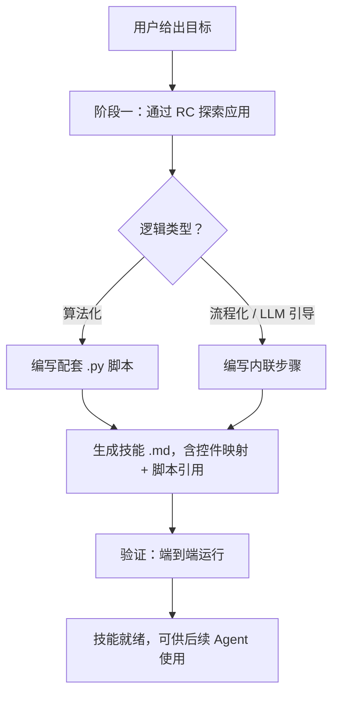

# SlateBot 脚本编写指南

> # 🛑 停！先读这里！🛑
> **你是黑盒 Agent。** 你无权访问目标应用的源码。禁止从磁盘读取文件、
> 搜索文件内容、探索目录树、或将探索任务委派给子 Agent——只要数据来自
> 目标应用的 `.py`、`.cpp`、`.h`、`.uasset` 或标记/蓝图文件，就属于禁区。
> **所有发现必须通过 RemoteControl HTTP API 完成。**
> 完整规则见 [法则 #1](#-法则-1纯黑盒--违反即无效技能-)。

将任意 UE5 UMG 应用视为**黑盒**，通过 SlateBot + RemoteControl 编程驱动它。
工作流分三个阶段：**探索**应用以理解其控件和交互，**自动化**操作以
Python 脚本或 Markdown 技能文档执行，必要时**扩展** SlateBot 机制本身。

本技能的核心是**使用**应用——点击按钮、读取显示、填写表单、导航菜单。
测试只是众多用例之一；同样的工具还能驱动机器人、求解器、宏录制器、
数据提取器，以及任何需要在无人值守下与 UE5 界面交互的场景。

---

## ⛔⛔⛔ 法则 #0：无探索 = 禁止输出 ⛔⛔⛔

> **在亲自调用 RemoteControl API 并收到真实响应之前，你不得写出任何一行技能输出。**

这与源码无关——关键在于**证据**。你生成的技能中的每一个事实（控件路径、颜色阈值、
委托类型、网格尺寸）都必须来自你**亲自观测到**的 RemoteControl API 响应。
领域知识（"扫雷是 9×9 网格"）、文档、从其他技能中推断的信息，都不能替代。

### 🛑 硬性门禁 —— 满足以下全部条件才可进入阶段二：

| # | 要求 | 如何满足 |
|---|------|---------|
| 1 | 目标应用在 UE5 编辑器中**正在运行** | 用户确认，或 `GetSlateBotInstances()` 返回该实例 |
| 2 | 已调用 `GetWidgetTreeDiff` 并收到**非空**响应 | 响应中包含真实的 `WidgetPath` 字符串，而非 `[]` |
| 3 | 已从 diff 中识别出每个交互控件的**精确**路径 | 从 `WidgetPath` 字段提取——不可猜测、不可从其他技能复制 |
| 4 | 已从每个关键控件读取至少一个**可观察状态属性**（`Text`、`BrushColor`、`Visibility`） | 来自 `GetWidgetTreeDiff` 的 `Properties` 或 `/remote/object/property` 回退 |
| 5 | 已发送至少一次 `SendClick` 并通过后续 diff **确认了状态变化** | 仅返回 `bSuccess: True` 但无观察变化的不算——先排查问题 |
| 6 | 已根据 diff 中的**实际颜色值**区分出所有视觉状态（隐藏/翻开/标旗等） | 颜色阈值从真实 API 响应标定，不可假设 |

### 🛑 如果应用未运行：

**立即停止。** 不要写任何技能文件。不要"先写个草稿"。不要输出你从之前会话
记住的控件路径。

向用户提问：
> "请在 UE5 编辑器中启动目标应用，我才能通过 RemoteControl 探索它。
> 没有实时 API 响应，我无法生成技能。"

等待用户确认应用已运行，然后再开始探索。

### 🛑 自检 —— 写出任何技能输出（SKILL.md、.py 等）之前：

```
我是否亲自调用了 GetWidgetTreeDiff 并收到了真实响应？
  否 → 终止。请用户启动应用。禁止生成输出。
  是 → 检查：我输出中的控件路径是否来自该响应？
         否 → 终止。仅用观测到的数据重写。
         是 → 进入阶段二生成。
```

### 🛑 禁止的捷径

| ❌ 绝不要这样做 | ✅ 应这样做 |
|----------------|------------|
| 仅凭领域知识写技能，不调用任何 API | 请用户启动应用；先通过 `GetWidgetTreeDiff` 探索 |
| 从其他技能的文档或示例中复制控件路径 | 调用 `GetWidgetTreeDiff`，从实时响应中提取路径 |
| 假设之前会话的颜色阈值 | 从当前会话的 diff 值重新标定 |
| 根据常识猜测网格尺寸 | 在 diff 中统计网格容器的子控件数量 |
| 先写一个"模板"脚本，后面再优化 | 探索必须先于一切——没有证据就没有输出 |

---

## ⛔⛔⛔ 法则 #1：纯黑盒 —— 违反即无效技能 ⛔⛔⛔

> **这不是建议，这是本技能的根本法则。阅读过应用源码后生成的技能无效。**

Agent 是一个**远程观察者**，只能读取控件属性并发送输入事件——就像人类用户
只能看到屏幕并点击。所有发现**必须**通过 RemoteControl HTTP API
（`GetWidgetTreeDiff`、`GetSlateBotInstances`、`/remote/object/property`、
`/remote/object/describe`、`SendClick` 等）完成。

### 🛑 自检 —— 每次工具调用前，问自己：

```
这次工具调用会读取应用源码吗？
  是 → 终止。改用 RemoteControl。
  否 → 继续。
```

"应用源码"指属于目标应用的**任何**文件，无论语言或格式：

| ❌ 禁止的文件类型 | 说明 |
|-------------------|------|
| `.py` Python 源码 | 任何实现目标应用逻辑、UI 组件或数据模型的 `.py` 文件 |
| `.cpp` / `.h` C++ 源码 | 目标应用 Source/ 目录下的任何 C++ 文件 |
| `.uasset` / `.umap` | 目标应用的任何二进制 Unreal 资源（含 Blueprint） |
| 标记 / 声明式 UI 文件 | 任何定义目标应用控件树或布局的文件（XML、JSON 等） |
| `.json` dump 文件 | 除非已确认为 RemoteControl API 响应 |

### 🛑 禁止的行为（无论你有什么工具）

| ❌ 行为类别 | 说明 |
|------------|------|
| **从磁盘读取文件** | 打开、读取或显示属于目标应用的任何文件内容 |
| **搜索文件内容** | 在目标应用源码树中搜索类名、事件名、常量或游戏规则 |
| **列出 / 探索目录** | 发现目标应用的文件结构、枚举源文件或遍历其目录树 |
| **委派给子 Agent** | 让子 Agent 去探索、读取或分析目标应用的源码 |
| **获取外部文档** | 检索描述特定目标应用内部实现的文档 |

> **自检准则：** 如果某工具调用能获取到人类用户仅通过看屏幕和点击
> **无法**获得的关于目标应用的信息，就是禁止的。RemoteControl API
> 是你观察应用的**唯一窗口**。

### 🛑 禁止的工作流

| ❌ 绝不要这样做 | ✅ 应这样做 |
|----------------|------------|
| 读取应用的 Python 文件来了解网格大小或游戏规则 | 调用 `GetWidgetTreeDiff`，统计控件节点数；向用户询问领域知识 |
| 读取应用的组件文件来了解视觉状态 | 通过 diff 读取每个控件的 `Text` + `BrushColor` |
| 在源码中搜索常量（`ROWS =`、`MINES =` 等） | 观察状态/计数控件的初始值；统计可交互元素数量 |
| 读取声明式 UI 文件来了解控件名称 | `GetWidgetTreeDiff` → 检查 `WidgetPath` 字段 |
| 读取源码来发现事件处理函数名 | `GetWidgetTreeDiff` → 检查 `Delegates` 数组 |
| 把探索任务委派给子 Agent | 自己调用 `GetSlateBotInstances()` + `GetWidgetTreeDiff` |
| 为了"省时间"而读源码 | 没有捷径。探索本身就是工作流。 |

### ✅ 允许的操作

- 调用 RemoteControl API 读取控件属性、发送输入事件。
- 编写调用 RemoteControl API 的 Python 自动化脚本。
- 从脚本中输出 JSONL 日志。
- 基于观察到的行为推理应用规则。
- 黑盒观察不足时向用户提问。
- 读取 `Skills/slatebot-scripting/` 下的文件（技能本身）。
- 读取已生成技能的目录下的文件（`.github/skills/automate-<slug>/`）。
- 读取 SlateBot C++ 插件源码（`Game/Plugins/SlateBot/Source/`）——这是
  **自动化框架**，不是目标应用。

### 为什么这很重要

阅读源码违背了黑盒测试的根本目的。测试的意义在于从**外部**验证应用
的正确性——通过真实用户或外部工具所使用的相同接口。如果 Agent 读了源码，
可能会无意识地依赖真实用户看不到的实现细节，导致测试脆弱且遗漏真正的 bug。

> **如果你想读某个源文件，停下来。** 问自己："哪个 RemoteControl 调用
> 能给我这个信息？" 如果没有这样的调用，这本身就是一个发现——应用存在
> 可观测性缺口。向用户报告。

---

## Agent 工作流（快速入门）

> # ⚠️ 开始之前务必阅读 ⚠️
> 1. 阅读 [法则 #0](#-法则-0无探索--禁止输出-) —— 未经 RemoteControl
>    探索，不得写出任何技能输出。
> 2. 阅读 [法则 #1](#-法则-1纯黑盒--违反即无效技能-) ——
>    不得读取目标应用的源码。

当用户给你一个自动化目标时，按以下顺序执行。每完成一步简要报告进展——不要等到最后才汇报。

| 步骤 | 做什么 | 详细指南 |
|------|--------|---------|
| **1. 明确领域** | 问用户这是什么类型的应用 | *（下方）* |
| **2. 探索** 🛑 | 通过 RemoteControl API 探测运行中的应用 | [阶段一](#阶段一--探索agent-主导) |
| **3. 确认** | 向用户展示控件映射 + 行为模型 | *（下方）* |
| **4. 生成** | 编写 `SKILL.md` + 配套 `.py` 脚本到 `.github/skills/automate-<slug>/` | [阶段二](#阶段二--生成自动化技能文档) |
| **5. 验证** | 至少端到端运行一次 | [排错指南](#排错指南) |
| **6. 报告** | 告诉用户：生成了什么、完整的 `.github/skills/automate-<slug>/` 路径，以及结果 | *（下方）* |

> 🛑 **步骤 2 是硬性门禁。** 在进入步骤 3 之前，必须满足
> [法则 #0 检查表](#-硬性门禁--满足以下全部条件才可进入阶段二) 中
> 的全部 6 项要求。如果应用未运行，立即停止并要求用户启动。
> 探索完成之前，不得生成任何文件。
>
> 🛑 **步骤 4 前置检查：** 在创建任何文件之前，确认以下两点：
> 1. 你在**本次会话**中亲自调用了 `GetWidgetTreeDiff` 并收到了真实响应。
>    参见 [法则 #0 自检](#-自检--写出任何技能输出skillmdpy-等之前)。
> 2. 你正在 **`.github/skills/automate-<slug>/`** 下创建文件——
>    不要在 SlateBot 插件里、不要在临时目录、不要在任何其他地方。
>    这是 VS Code Copilot 标准的 workspace 技能发现路径。
>    创建在其他位置的技能，未来 Agent 将无法找到。

---

## 阶段一 —— 探索（Agent 主导）

> **🔴 纯黑盒：** 此阶段所有发现均通过 RemoteControl HTTP 调用完成。
> Agent 禁止读取源文件（`.py`、`.cpp`、`.h`、`.uasset`、blueprint 资源、
> 声明式 UI 标记）来了解应用。控件名称、网格大小、游戏规则、事件绑定——
> 一切都通过 `GetWidgetTreeDiff`、属性读取和点击观察实验来发现。详见上方
> [法则 #1](#-法则-1纯黑盒--违反即无效技能-) 章节。

在编写任何自动化代码之前，Agent 与运行中的应用交互，建立对界面的心智模型。
此阶段是**对话式的、随机的**——Agent 探测、观察、实验。

### 要发现什么

发现过程分两层：**领域知识**（从用户那里获知的信息）加上**黑盒观察**
（通过 RemoteControl 实际测量）。

**第一层 —— 领域知识（先问用户，再运用常识）**

在探测之前，先问用户这是什么类型的应用。用户的回答给你**领域模型**——
这类应用的通用概念和规则，而非实现细节：

- "一个解谜游戏" → 数字 = 相邻雷数，右键 = 插旗。
- "一个注册表单" → 文本框期望用户输入，提交按钮发送数据。
- "一个排行榜" → 行代表排名条目，列是属性。

这**不是**读源码——这是领域常识。用它来解读观察结果，而不是跳过观察。
即使你"知道"典型的网格大小或雷数，仍要通过实验验证。领域知识告诉你
*数字意味着什么*；观察告诉你*数字是多少*。

**第二层 —— 黑盒观察（测量一切）**

| 问题 | 方法 |
|------|------|
| 有哪些 SlateBot 实例？ | `GetSlateBotInstances()` |
| 控件树结构是什么样的？ | `GetWidgetTreeDiff`（首次调用 = 全量树 + 属性）；详见[控件树 Diff API](#控件树-diff-api) |
| 哪些控件可交互？ | 探测 `bIsEnabled`、`Visibility` |
| 每个可交互控件上**绑定了哪些事件**？ | `GetWidgetTreeDiff` 在每个节点返回 `Delegates` 数组（`FSlateBotDelegateInfo`：`bHasBindings`、`TypeName`）；需要委托名称时可用 `/remote/object/describe` 作为备选；详见[发现控件事件](#发现控件事件) |
| 每个控件显示/控制什么？ | 读取 `Text`、`BrushColor` 等 |
| 点击能否命中正确的目标？ | 对控件 `SendClick`；同时尝试外层路径和 `WidgetTree_0.<子控件>` 路径 |
| 模拟点击是否触发了**预期的处理器**？ | `SendClick` 后**立即**回读可观察状态（文本、颜色、可见性） |
| 哪些视觉变化是**自动的**，哪些是输入驱动的？ | 交叉比对：没有点击就变化的属性大概率是自动的（绑定、tick、动画）；只有点击后才变化的属性是输入驱动的。注意：应用可能存在**随机性**——同样的点击不一定产生同样的结果，没有输入的变化也不一定意味着确定性行为 |
| 有哪些边界情况（禁用态、动画、时序）？ | 观察和实验 |

### 探索循环

```
GetWidgetTreeDiff（基线） —— 探测事件绑定 —— 点击 —— GetWidgetTreeDiff（变化）
      |                                                              |
      └────── 有疑问时向用户提问 ←───────────────────────────────────┘
                            （消除歧义、确认方案）
```

目标是充分理解应用以便自动化，但 Agent **不必硬猜**。当心智模型不够清晰——
控件行为模糊、状态转换出乎意料、结果不确定——Agent **向用户提问**澄清。
进入阶段二之前，Agent 也可以将探索发现和拟定的自动化方案呈现给用户确认。

核心原则：

1. **点击前先检查委托绑定。** 使用 `GetWidgetTreeDiff` → `Delegates` 数组：
   `bHasBindings: true` 表示 `SendClick` 能触发处理器。如果所有委托都显示
   `bHasBindings: false`，跳过该控件——点击白费。详见[发现控件事件](#发现控件事件)。

2. **分清自动变化和输入驱动变化。** 没有点击就变化的属性大概率是自动的
   （绑定、tick、动画）。只有特定点击之后才出现的变化是输入驱动的。
   注意：应用可能存在**随机性**——同样的点击不一定复现同样的结果。

3. **检查所有变化的属性，而非仅检查你预期的那一项。** 每批交互之后，调用
   `GetWidgetTreeDiff` 并检查**每个**变化节点上的**每个** `Property`。
   单一属性可能遗漏状态转换（例如网格格子翻开且相邻雷数为 0 时——`Text`
   仍为 `""` 但 `BrushColor` 已变化）。从所有变化的并集中构建状态模型。

4. **迭代并遇到不确定时提问。** 每次观察收窄模型。如果行为模糊，暂停
   并询问用户。进入阶段二之前，将控件映射、行为模型和自动化方案呈现给
   用户确认。

Agent 通过 RemoteControl 调用 SlateBot 函数、读取控件属性，逐步建立理解。
此阶段不写脚本——纯粹是发现的过程。

### 引导流程（Bootstrap）

每次开始探索一个新应用时，按以下步骤启动，避免在未就绪的应用上空转：

1. **发现实例** —— `GetSlateBotInstances()`，提取前缀。
2. **确认应用已就绪** —— 读取一个你预期有特定值的已知控件属性，验证其值符合预期。
   若不符合，等 0.5 s 重试，最多 5 次。此步骤防止在初始化未完成时点击导致假阴性。
3. **探索控件树** —— `GetWidgetTreeDiff` 一次性获取完整树 + 属性。首次调用返回全量，
   后续自动增量。
4. **分类控件** —— 对每个控件读取 `Visibility`、`bIsEnabled`，标记为"可交互"/
   "仅显示"/"不可见"。
5. **检查事件绑定** —— 对可交互控件，检查 `GetWidgetTreeDiff` 节点中的 `Delegates`
   数组，查看哪些委托有运行时绑定（`bHasBindings: true`）。
6. **实验验证** —— 对有绑定处理器的控件发送 `SendClick`，立即回读状态验证效果。

> 第 2 步至关重要：跳过它会导致大量无效点击和错误结论。

---

## 阶段二 —— 生成自动化技能文档

阶段一探索完成并收到用户确认后，决定自动化形式：

- **算法化逻辑**（扫描 → 计算 → 点击 → 重复）→ 在技能目录的
  `Scripts/` 子目录中编写 **Python 配套脚本**。
- **智能决策**（解读标签文本、适应布局变化）→ 在技能文档中编写
  **内联分步指令**。

生成的技能**必须**创建在 workspace 根目录下的
**`.github/skills/automate-<slug>/`**（VS Code Copilot 标准 workspace
技能发现路径）。配套 Python 脚本放在
`.github/skills/automate-<slug>/Scripts/` 中。技能仅引用 SlateBot
RemoteControl API——**不得引用目标应用的任何源码。**

然后创建 `.github/skills/automate-<slug>/SKILL.md`（参照下方模板），
编写配套脚本（如需），端到端验证，然后报告。

### 生成的技能文档模板

每个生成的技能文档必须包含以下章节：

```markdown
# Automate: <一句话目标描述>

## Goal
<用户的目标，1–2 句话，按用户原话表述。>

## Prerequisites
- SlateBot 实例：`<InstanceName>`
- 启动命令：`<打开应用的控制台命令>`
- RemoteControl：`http://127.0.0.1:30010`
- 配套脚本：`<技能目录的 Scripts/ 子目录中的 .py 文件列表>`

## Widget map（探索时发现的控件映射）
| 控件路径模式 | UMG 类 | 角色 | 是否点击目标 |
|-------------|--------|------|:----------:|
| `...CounterDisplay` | `TextBlock` | 显示当前计数值 | ❌ |
| `...IncrementButton` | `Button` | 计数 +1 | ✅ |
| `...ResetButton` | `Button` | 重置为 0 | ✅ |

> 每次运行通过 `GetSlateBotInstances()` 重新获取瞬时前缀。
> `CounterDisplay` 等控件名是稳定的；只有世界前缀会变化。

## Application behavior model（探索时发现的行为模型）

<记录从观察中推理出的规则，用领域知识加以丰富。
这是将原始控件数据转化为可执行自动化逻辑的关键。>

### State representation（状态表示）
- 每个逻辑状态如何映射到可观察的控件属性？
  （例如：禁用按钮 → `bIsEnabled=false` + `RenderOpacity=0.5`；
   选中行 → `BrushColor` 从灰色变为蓝色；
   状态"空"与"隐藏" → 两者 `Text` 均为 `""` 但 `BrushColor.R` 不同）
- 是否存在在不同属性中表现一致的状态？

### Interaction rules（交互规则）
- 点击每个状态的控件会发生什么？
- 哪些变化是输入驱动的，哪些是自动的（级联、动画、绑定）？
- 是否存在安全保证？（例如首次交互不会触发破坏性操作）

### Terminal conditions（终端条件）
- 成功、失败或需要重启的可观察信号。
- 如何确认应用处于已知的干净状态。

### Discovered parameters（发现的参数）
- 网格尺寸、元素数量、命名约定。
- 已标定的颜色阈值，用于视觉状态分类。

## Automation procedure（自动化步骤）

### Step 1 — Launch & confirm ready（启动并确认就绪）
- 通过 `ExecuteConsoleCommand` 执行启动命令。
- 轮询 `GetSlateBotInstances()` 直到 `<InstanceName>` 出现。
- 读取已知控件属性以确认初始化完成。

### Step 2 — Observe initial state（观察初始状态）
- 调用 `GetWidgetTreeDiff`（首次调用 = 全量树）。
- 验证预期的控件存在且可交互。

### Step 3 … N — Action loop（操作循环）
每个逻辑步骤：
- **观察：** 读取相关控件属性。
- **决策：** 从观察到的状态计算下一步操作。
- **执行：** `SendClick` / `SendKey` / `SendText`。
- **验证：** 回读状态确认操作生效。

如果由配套 Python 脚本处理循环，将步骤 3…N 替换为：
- 运行 `python .github/skills/automate-<slug>/Scripts/<配套脚本>.py <参数>`。
- 脚本读取状态、计算操作并自主点击。
- 技能文档验证最终结果。

## Edge cases & recovery（边界情况与恢复）
- 控件未找到或已禁用时的处理。
- 如何检测和恢复卡死状态（参见最佳实践 §10）。
- 如何重启/重试。

## Success criteria（成功标准）
- 目标达成的可观察条件。
- 目标失败的可观察条件。
```

### 命名约定

| Goal | 技能目录 | 脚本文件（如有） |
|------|---------|-----------------|
| 填充计数器到目标值 | `.github/skills/automate-counter-fill/` | `.github/skills/automate-counter-fill/Scripts/counter_fill.py` |
| 填写注册表单 | `.github/skills/automate-registration-fill/` | *（内联步骤，无脚本）* |
| 导出排行榜为 CSV | `.github/skills/automate-leaderboard-export/` | `.github/skills/automate-leaderboard-export/Scripts/leaderboard_export.py` |

### 生成的技能文档必须捕获的信息

以下是后续 Agent 所需的最低限度事实——缺少任何一项都需要从头重新探索：

| 事实 | 阶段一中的来源 |
|------|-------------|
| 实例名称和启动命令 | `GetSlateBotInstances()` + 用户提示 |
| 交互控件的控件路径 | `GetWidgetTreeDiff` 首次调用 |
| 哪些委托已绑定（`bHasBindings: true`） | `GetWidgetTreeDiff` → `Delegates` 数组 |
| 点击目标（外层 vs `WidgetTree_0.<child>`） | 用 `describe` + `Visibility` 探测 |
| 可观察的状态指标（Text、BrushColor 阈值） | 标定读取 |
| 应用行为模型（状态映射、交互规则、终端条件） | 观察 + 用户提供的领域知识 |
| 重启/恢复的控件路径 | 控件树探索 |

### 与配套 Python 脚本的关系

生成的技能文档是**首要产物**。配套脚本是技能文档调用的**可选辅助工具**。
技能文档必须仍包含控件映射和足够的上下文，以便后续 Agent 理解脚本在做什么
并能够诊断失败——脚本不是黑盒中的黑盒。



---

## 技术参考

以下章节适用于生成的技能文档和配套脚本。编写 Python 辅助函数或编写自动化技能文档时都可以参考。

### 控件树 Diff API

`GetWidgetTreeDiff(InstanceName)` 是探索阶段的核心入口。

- **首次调用**：返回完整控件树，每个节点携带全部可读属性值。
- **后续调用**：只返回变化节点 + 祖先链（`ParentPath` 可重建树结构），变化节点只含差异属性。
- 缓存自动更新——无变化时返回空数组。

```python
def get_tree_diff(instance_name):
    r = requests.put(f'{BASE}/remote/object/call', json={
        'objectPath': '/Script/SlateBot.Default__SlateBotFunctionLibrary',
        'functionName': 'GetWidgetTreeDiff',
        'parameters': {'InstanceName': instance_name},
    }, timeout=10)
    return r.json().get('ReturnValue', []) if r.status_code == 200 else []
```

`FSlateBotTreeNodeInfo` 字段：

| 字段 | 说明 |
|------|------|
| `WidgetPath` | 对象路径 |
| `ParentPath` | 父节点路径（根为空） |
| `WidgetClass` | UClass 路径，如 `"/Script/UMG.Border"` |
| `Properties` | 变更属性列表（`FSlateBotPropertyInfo`：`PropertyName`、`OldValue`、`NewValue`） |
| `Delegates` | 委托绑定状态（`FSlateBotDelegateInfo`：`bHasBindings`、`TypeName`）；首次调用和新控件时填充 |

> 相比手动 BFS 逐个 `GetChildrenCount`/`GetChildAt`，`GetWidgetTreeDiff` 一次调用
> 拿完整树 + 属性，且后续自动做增量 diff。

### 重置 Diff 缓存

`ResetWidgetTreeCache(InstanceName)` 清除指定实例的内部快照。
下一次 `GetWidgetTreeDiff` 调用将表现为**首次调用**——返回完整树，所有属性和委托均填充。

适用场景：
- 启动新的自动化运行，让首次 diff 获得干净的基线。
- 应用状态重置后重新运行自动化。
- 应用关闭后重新打开，缓存快照已过期。

```python
def reset_cache(instance_name):
    requests.put(f'{BASE}/remote/object/call', json={
        'objectPath': '/Script/SlateBot.Default__SlateBotFunctionLibrary',
        'functionName': 'ResetWidgetTreeCache',
        'parameters': {'InstanceName': instance_name},
    }, timeout=5)
```

### 控件树导航（手动方式）

`GetWidgetTreeDiff` 覆盖大部分场景。以下为手动遍历的补充方法。

#### UMG 对象路径

每个 UWidget 都有稳定的对象路径：

```
/Engine/Transient.World_X:MyWidget_C_0.WidgetTree_0.MyButton
```

- 前缀（到 `WidgetTree_0` 为止）来自 `GetSlateBotInstances()`。
- 追加 `.<控件名>` 即可访问任意具名控件。

#### 自定义控件的内部子控件

自定义控件通过 **`WidgetTree_0` 后缀**暴露其内部树结构：

```
{Prefix}.MyComponent.WidgetTree_0.MyBorder
{Prefix}.MyComponent.WidgetTree_0.MyLabel
```

> `GetChildrenCount()` / `GetChildAt()` 对动态创建的组件可能返回 0。
> 此时应使用显式的 `WidgetTree_0.<子控件名>` 路径。

#### 遍历辅助函数（UMG 内置）

| 函数 | 适用对象 | 备注 |
|------|----------|------|
| `GetChildrenCount()` | `UPanelWidget` | 直接子控件数量 |
| `GetChildAt(Index)` | `UPanelWidget` | 返回子 UWidget 路径 |
| `GetText()` | `UTextBlock` 等 | 显示的文本（可能为 `""`） |
| `GetAccessibleSummaryText()` | 任意 | Slate 无障碍文本 |

#### 按名称查找控件

```python
def find_named(parent_path, name_fragment, max_depth=8):
    seen = {parent_path}
    queue = [parent_path]
    for _ in range(max_depth):
        for p in queue:
            if name_fragment in p:
                return p
            for child in get_children(p):
                if child not in seen:
                    seen.add(child)
                    queue.append(child)
    return None
```

### 读取控件状态

**优先使用 `GetWidgetTreeDiff`** 作为主要的状态读取机制——
1 次 HTTP 调用替代 9×9 网格的 162 次。首次调用返回完整树，
后续调用返回增量 diff。

#### 本地状态缓存（可持久化到磁盘）

由于 `GetWidgetTreeDiff` 已经提供了所有控件状态，在自动化脚本中维护一个
**本地缓存**，镜像每个控件的最后已知状态。缓存从首次 `GetWidgetTreeDiff`
调用中构建，后续 diff 时增量更新。这意味着脚本**无需**常驻内存——可以
将缓存持久化到磁盘（JSON 文件），下次运行时重新加载：

```python
import json, os

CACHE_FILE = 'widget_state_cache.json'

def load_cache():
    if os.path.exists(CACHE_FILE):
        with open(CACHE_FILE, 'r') as f:
            return json.load(f)
    return {}

def save_cache(cache):
    with open(CACHE_FILE, 'w') as f:
        json.dump(cache, f, indent=2)

def update_cache_from_diff(cache, diff_nodes):
    """将 GetWidgetTreeDiff 结果应用到本地缓存。"""
    for node in diff_nodes:
        widget_path = node['WidgetPath']
        if widget_path not in cache:
            cache[widget_path] = {'class': node.get('WidgetClass', '')}
        for prop in node.get('Properties', []):
            cache[widget_path][prop['PropertyName']] = prop['NewValue']

def read_cached(cache, widget_path, property_name):
    """从本地缓存读取属性（无需 HTTP 调用）。"""
    return cache.get(widget_path, {}).get(property_name)
```

有了持久化缓存，自动化逻辑可以分散在多个短生命周期的脚本调用中——
每次运行加载缓存 → 计算下一步操作 → 发送输入 → diff 变更 → 更新缓存 →
存盘退出。

常用可读属性（均通过标准 UMG 数据绑定管线更新，全部可信）：

| 属性 | 类型 | 示例 |
|------|------|------|
| `Text` | `FText` | `"Hello"` |
| `BrushColor` | `FLinearColor` | `{"R":0.86,"G":0.86,"B":0.88}` |
| `ColorAndOpacity` | `FSlateColor` | `{"R":1,"G":1,"B":1,"A":1}` |
| `Visibility` | `ESlateVisibility` | `"Visible"` / `"Hidden"` |
| `bIsEnabled` | `bool` | `true` |
| `RenderOpacity` | `float` | `1.0` |

> **空块检测：** 当一个格子揭开后周围没有相邻物品时，`Text` 保持 `""`
> 但 `BrushColor` 会变化（如 R≈0.72 → R≈0.86）。`GetWidgetTreeDiff`
> 会报告两者；务必检查**所有**变更的属性。

#### 备选：逐属性读取

当只需要读取已知控件的单个属性时，`/remote/object/property` 端点可作为
直接备选方案：

```python
def prop(obj_path, property_name):
    r = requests.put(f'{BASE}/remote/object/property',
                     json={'objectPath': obj_path, 'propertyName': property_name})
    if r.status_code != 200:
        return None
    data = r.json()
    # 键是属性名：{"Text": "Hello"}
    return data.get(property_name) if property_name in data else data.get('PropertyValue')
```

### 发现控件事件

在发送输入之前，先确定**每个控件能接收哪些事件**。这告诉你 `SendClick`（以及未来的输入函数）能触发什么。

#### 委托信息如何暴露

`GetWidgetTreeDiff` 在每个树节点上返回 `Delegates` 数组（首次调用及新出现的控件）。
每个条目是 `FSlateBotDelegateInfo`，包含两个字段：

| 字段 | 含义 |
|------|------|
| `bHasBindings` | 运行时至少有一个函数绑定时为 `true` |
| `TypeName` | C++ 类型名（`"FOnPointerEvent"`、`"FOnButtonClickedEvent"` 等） |

#### 工作流程

1. 在第一轮探索时调用 `GetWidgetTreeDiff`——返回完整树，每个节点都填充了 `Delegates`。
2. 对每个可交互控件，检查 `Node.Delegates`。任何 `bHasBindings: true` 的条目意味着
   有处理器绑定，`SendClick` 可以触发它。
3. 如果某个控件完全没有委托条目，用 `/remote/object/describe` 作为备选来发现委托属性
   *名称*（寻找 `FOn…` 类型），然后在控件完全初始化后重新调用 `GetWidgetTreeDiff`。

> **关键点：** 委托绑定状态直接从 `GetWidgetTreeDiff` 获取——无需单独的 API 调用。
> `Delegates` 数组始终存在于首次 diff（或新控件首次出现时）返回的节点上。
> 在后续增量 diff 中，未变化的祖先节点不携带委托信息；使用首次调用数据或调用
> `ResetWidgetTreeCache` 强制全量刷新。

#### 委托类型模式

UMG 控件上常见的委托类型：

| Type 模式 | 示例属性 | 触发时机 |
|-----------|----------|----------|
| `FOnPointerEvent` | `OnMouseButtonDownEvent`、`OnMouseButtonUpEvent`、`OnMouseMoveEvent` | 鼠标与控件交互 |
| `FOn…ClickedEvent` | `OnClicked` | 按钮点击确认 |
| `FOn…PressedEvent` | `OnPressed` | 按钮按下开始 |
| `FOn…ReleasedEvent` | `OnReleased` | 按钮按下结束 |
| 其他 `FOn…` 类型 | 多种 | 控件特定事件 |

#### 解读委托信息

| TypeName | bHasBindings | 结论 |
|----------|-------------|------|
| *(任意)* | `false` | 委托存在但**没有绑定**——跳过此控件 |
| *(任意)* | `true` | 委托存在且**有处理器绑定**——`SendClick` 可以触发 |
| *(无 Delegates 条目)* | — | 控件没有委托属性——`SendClick` 无法触发处理器 |

> `/remote/object/property` 对委托类型属性返回 `null`；
> 委托绑定状态只能通过 `GetWidgetTreeDiff` 获取。
>
> **仅通过黑盒方式发现：** 使用 `GetWidgetTreeDiff` 和
> `/remote/object/describe` 来发现委托。禁止阅读 C++ 头文件或
> 源码来查找委托声明——运行时 API 才是实际绑定和功能状态的真相来源。

---

### 输入模拟 —— `SendClick`

```python
def click(widget_path, right_button=False):
    rpc(FN_LIB, 'SendClick', {
        'Widget': widget_path,
        'Options': {
            'Button': {'KeyName': 'RightMouseButton' if right_button else 'LeftMouseButton'},
            'ClickType': 'Single',
            'ModifierKeys': {
                'bControl': False, 'bAlt': False,
                'bShift': False, 'bCommand': False,
            },
            'RelativePosition': {'X': 0.5, 'Y': 0.5},
        },
    })
```

- `Widget` 是 UWidget 对象路径。
- `RelativePosition` 范围 0–1；`(0.5, 0.5)` = 中心。
- `ClickType`：`"Single"` 或 `"Double"`。
- `SendClick` 能触发目标控件上**所有**通过 Slate 路由的 UMG 委托属性，
  不仅是 `OnClicked`。包括所有 `FOnPointerEvent` 委托
  （`OnMouseButtonDownEvent`、`OnMouseButtonUpEvent` 等），以及任何通过
  `FSlateApplication` 输入管道触发的其他委托。模拟点击与真实鼠标输入使用
  相同的 Slate 事件路径——没有架构层面的区别。
- 对于复合/自定义控件，通过 `WidgetTree_0.<子控件名>` 定位内部子控件（见最佳实践 §2）。
- **右键是切换操作。** 若目标控件用右键在两个状态间切换（如标记 ⇄ 取消标记），
  同一轮中第二次右键同一控件会撤销第一次操作。务必用集合记录本轮已操作的目标，
  避免重复（详见最佳实践 §3）。
- **始终验证应用已完全初始化**再对 `SendClick` 结果下结论。若点击返回
  `bSuccess: True` 但没有产生可观察的状态变化，按[排错指南](#排错指南)逐项排查。

### 输入模拟 —— `SendKey` / `SendText`

键盘输入直接发送到当前拥有焦点的控件，无需指定目标路径。

```python
def send_key(key_name, ctrl=False, alt=False, shift=False, cmd=False):
    """模拟按键（down + up）。key_name 如 'Enter', 'Tab', 'Escape', 'A'。"""
    rpc(FN_LIB, 'SendKey', {
        'Key': {'KeyName': key_name},
        'Modifiers': {
            'bControl': ctrl, 'bAlt': alt,
            'bShift': shift, 'bCommand': cmd,
        },
    })

def send_text(text):
    """模拟输入字符串（逐字符发送 Character 事件）。"""
    rpc(FN_LIB, 'SendText', {'Text': text})
```

| 函数 | 适用场景 |
|------|----------|
| `SendKey` | 快捷键（Ctrl+S）、导航键（Tab, 方向键）、功能键（Enter, Escape） |
| `SendText` | 向当前聚焦的文本框输入文字 |

> 两者均走 `FSlateApplication` 标准输入管道——与真实键盘输入完全等效。

---

## 性能说明

- 每次 HTTP 请求约 300–500 ms（localhost，含 UE5 处理时间）。
- `time.sleep(0.1–0.2)` 是足够的点击间隔；批量标记/点击每次 `0.06` s。
- 在重新扫描之前计算出所有确定性操作，以最小化往返次数。
- 顺序调用使用 `requests.Session()` 以复用连接。

### ⛔ 扫描策略 —— 始终优先使用 `GetWidgetTreeDiff`

当需要批量观察控件状态时（例如扫描游戏棋盘、读取表格、检查表单），
**必须**将 `GetWidgetTreeDiff` 作为主要机制。这不是建议，是正确的设计。

| 方式 | 每次扫描请求数（9×9 网格） | 耗时 |
|------|:-------------------------:|------|
| 逐属性读取（`/remote/object/property` × 162） | 162 | ~6.5 s |
| **`GetWidgetTreeDiff`** | **1** | **~0.5 s** |

**工作原理：**
- **首次调用**（在 `ResetWidgetTreeCache` 之后）：返回**完整**控件树，
  每个节点都填充了 `Properties`——用于初始化本地状态模型。
- **后续调用**（点击之后）：**仅**返回变化的节点，含 `OldValue` / `NewValue`
  差异——增量更新本地状态。
- API 自动维护快照；批量观察时完全不需要逐属性读取。

**反模式（禁止）：**
```python
# ❌ 9×9 棋盘需要 162 次 HTTP 调用
for r in range(rows):
    for c in range(cols):
        text = prop(f'{prefix}.GridItem_{r}_{c}.WidgetTree_0.ItemLabel', 'Text')
        color = prop(f'{prefix}.GridItem_{r}_{c}.WidgetTree_0.ItemBorder', 'BrushColor')
```

**正确模式：**
```python
# ✅ 1 次 HTTP 调用
diff = get_tree_diff(instance_name)
for node in diff:
    path = node['WidgetPath']
    for prop in node.get('Properties', []):
        # prop['PropertyName'], prop['OldValue'], prop['NewValue']
        update_local_state(path, prop)
```

**逐属性读取仅适用于：**
- 读取单个已知控件的单个属性（例如检查状态标签是否变化）。
- 探索阶段的快速一次性探测。
- `GetWidgetTreeDiff` 返回异常结果时的备用方案。

任何涉及 5 个以上控件的情况，`GetWidgetTreeDiff` 都是更优选择。

---

## 最佳实践与经验总结

*已通过真实自动化脚本验证（解谜求解器、表单填写器）。*

### 1. 实例发现 —— 绝不硬编码路径

UMG 对象路径前缀包含瞬时的世界索引（如 `World_3`），每次重新打开控件时
都会变化。务必动态解析：

```python
def discover_prefix(instance_name):
    r = requests.put(f'{BASE}/remote/object/call', json={
        'objectPath': '/Script/SlateBot.Default__SlateBotFunctionLibrary',
        'functionName': 'GetSlateBotInstances',
        'parameters': {},
    }, timeout=5)
    for inst in r.json().get('ReturnValue', []):
        if inst.get('InstanceName') == instance_name:
            path = str(inst['SlateBot'])
            return path.rsplit('.SlateBot_', 1)[0]
    return None
```

如果未找到实例，通过控制台命令启动目标控件：

```python
requests.put(f'{BASE}/remote/object/call', json={
    'objectPath': '/Script/Engine.Default__KismetSystemLibrary',
    'functionName': 'ExecuteConsoleCommand',
    'parameters': {
        'WorldContextObject': None,
        'Command': 'YourApp.LaunchCommand /Path/To/YourApp',
        'SpecificPlayer': None,
    },
}, timeout=5)
```

### 2. 点击目标定位 —— 优先选择最内层可命中子控件

UMG 组合控件（自定义 `UUserWidget` 子类）通常将最外层容器设为不可命中
（hit-test-invisible），以便布局穿透正常工作。实际交互元素通常在其内部
一层，通过 `WidgetTree_0` 可达：

```python
# ✅ 正确 —— 点击拥有交互逻辑的子控件
target = f'{PREFIX}.MyCell.WidgetTree_0.ClickableBorder'

# ❌ 可能无效 —— 外层包裹器可能让命中测试穿透
target = f'{PREFIX}.MyCell'
```

**如何找到正确的目标：** 读取外层控件的 `Visibility`。如果是
`"Not Hit-Testable (Self Only)"` 或 `"HitTestInvisible"`，控件本身不会
接收点击。探测 `WidgetTree_0.<ChildName>`——第一个
`Visibility: "Visible"` 的子控件就是你的点击目标。

标准 UMG 基础控件（`Button`、`TextBlock`、`Border`）**不需要**
`WidgetTree_0`，直接可用。

### 3. 右键切换状态 —— 同一轮内必须去重

`SendClick` 配合 `RightMouseButton` 是一个**切换操作**——如果目标控件使用
右键在两个状态之间切换（如标记 ↔ 取消标记），同一分析轮次内对同一控件
第二次右键会撤销第一次的操作。务必用集合跟踪本轮已操作的控件：

```python
acted_this_round = set()

for target in deduce_targets(board):
    key = (target.row, target.col)
    if key not in acted_this_round:
        right_click(target)
        acted_this_round.add(key)
```

左键点击同理——使用单独的集合。

### 4. 并行读取 —— ThreadPoolExecutor

顺序读取大量控件很慢（81 个控件约需 56 s）。`ThreadPoolExecutor` 可以加速：

- **限制 10 个 worker** —— 兼顾速度和稳定性。
- **每个线程独立的 `requests.Session()`** 是必须的——session 对象**不是**
  线程安全的。
- Worker 内部添加**重试逻辑**（等待 50–100 ms，最多重试 2 次）。
- 如果并行批次完全失败，**回退**到顺序读取。

```python
from concurrent.futures import ThreadPoolExecutor, as_completed

def _read_one_item(index):
    s = requests.Session()  # 每线程独立 session
    for attempt in range(3):
        try:
            r = s.put(f'{BASE}/remote/object/property', json={...}, timeout=5)
            if r.status_code == 200:
                return r.json()
        except requests.ConnectionError:
            time.sleep(0.05 * (attempt + 1))
    return None  # 重试耗尽

with ThreadPoolExecutor(max_workers=10) as executor:
    futures = {executor.submit(_read_one_item, i): i for i in range(N)}
    for future in as_completed(futures):
        result = future.result()
        # ... 处理结果 ...
```

单线程调用（发现、点击）复用模块级别的 `requests.Session()` 以保持连接。

### 5. ⚠️ 不要使用 `/remote/batch`

`/remote/batch` 端点**会导致 Unreal Editor 崩溃**（已在 UE 5.x 上复现）。
崩溃发生在 `FWebRemoteControlModule::HandleBatchRequest` 中的
`TMap::FindChecked`。请改用并行单请求。

### 6. 状态观察策略 —— 优先使用文本而非颜色

在读取控件状态用于自动化逻辑时（例如将网格单元格分类为"隐藏"、"标记"、
"已揭示"），优先采用**基于文本**的观察：

- **读取子 `TextBlock` 的 `Text`**（例如单元格内部的标签）。`FText`
  UPROPERTY 更新在各种框架下都是可靠的。
- **避免仅依赖 `Border` / `Image` 上的 `BrushColor`**。某些框架更新的是
  Slate 级视觉属性而非 UPROPERTY，导致颜色读数显示过时的初始值。
- **如果颜色是唯一的区分方式**，使用
  [范围匹配](#7-视觉属性状态读取--使用范围匹配)，并**始终先标定**：
  读取一个已知处于某状态的控件，记录实际 RGB 值，然后定义每通道 ±0.10 的范围。

> **对于批量网格扫描，使用 `GetWidgetTreeDiff`，而非逐属性读取。**
> 下方的 `scan_grid` 模式仅作为 `GetWidgetTreeDiff` 不可用时的**备用方案**。
> 优先参考 [⛔ 扫描策略](#-扫描策略--始终优先使用-getwidgettreediff)
> —— 1 次 HTTP 调用 vs 162 次。


### 7. 视觉属性状态读取 —— 使用范围匹配

当从 `BrushColor` 或 `ColorAndOpacity` 等视觉属性推断逻辑状态时，实际 RGB
值可能因 Slate 视觉状态乘数（`pressed`/`hovered`/`highlighted`，通常
×1.05–1.20）而偏离标称值。

**通用方法：**
1. **先标定** —— 将应用置于已知状态（全新、重置），读取目标控件的视觉属性，
   记录基线。
2. **定义范围** —— 为每个逻辑状态指定每通道 RGB 范围（±0.10），而非精确值。
3. **验证边界** —— 手动触发状态变化（真实鼠标点击），确认范围分类正确。

```python
# 通用模式：基于范围的分类
STATE_RANGES = {
    'state_a': {'r': (0.00, 0.75), 'g': (0.00, 0.75), 'b': (0.00, 0.80)},
    'state_b': {'r': (0.75, 0.90), 'g': (0.75, 0.90), 'b': (0.75, 0.90)},
    'state_c': {'r': (0.90, 1.00), 'g': (0.30, 0.65), 'b': (0.30, 0.40)},
}

def classify_by_color(r, g, b):
    for state, ranges in STATE_RANGES.items():
        if (ranges['r'][0] <= r <= ranges['r'][1] and
            ranges['g'][0] <= g <= ranges['g'][1] and
            ranges['b'][0] <= b <= ranges['b'][1]):
            return state
    return 'UNKNOWN'
```

> 对阈值不确定时，从已知处于特定状态的控件读取视觉值，以该基线标定。

### 8. 验证操作是否生效

在执行状态变更操作（重启、提交、重置）之后，回读一个已知控件属性，
确认变更确实发生后再继续：

```python
restart_game()
time.sleep(0.5)
state = read_state(widget_that_should_change)
if not is_expected_state(state):
    restart_game()  # 重试一次
    time.sleep(0.5)
```

### 9. 处理所有属性变更，使用优先级分派

当使用 `GetWidgetTreeDiff` 进行增量状态追踪时，处理**每一个**变化节点上的
**每一个**变更属性——不要只过滤 `Text`。有些控件通过 `Text` 以外的属性改变
逻辑状态（例如：控件揭示时 `BrushColor` 变化但文本不变，`Visibility` 切换，
`bIsEnabled` 翻转）。

**按优先级分派：**

| 优先级 | 属性类别 | 原因 |
|:------:|---------|------|
| 1 | `Text` | 最常见的状态指示器；通常标志一次确定的状态变化 |
| 2 | 视觉（`BrushColor`、`ColorAndOpacity`、`Visibility`） | 当 `Text` 不变时可能标志状态转换 |
| 3 | 交互（`bIsEnabled`、`RenderOpacity`） | 指示控件可用性 / 禁用状态 |
| 4 | 其他所有属性 | 任何属性变化都是信号——检查并判断 |

**模式：**

```python
# 优先级分派映射表 —— 可按应用扩展
PROPERTY_PRIORITY = {
    'Text':             1,
    'BrushColor':       2,
    'ColorAndOpacity':  2,
    'Visibility':       2,
    'bIsEnabled':       3,
    'RenderOpacity':    3,
}

def apply_diff(diff, local_state):
    for node in diff:
        widget_id = parse_widget_id(node['WidgetPath'])
        props = node.get('Properties', [])

        # 按优先级排序，Text 变更优先处理
        props.sort(key=lambda p: PROPERTY_PRIORITY.get(p['PropertyName'], 4))

        for prop in props:
            pname = prop['PropertyName']
            new_val = prop['NewValue']

            # 始终更新本地缓存
            local_state[widget_id][pname] = parse_value(pname, new_val)

            # 每次属性变更后重新评估逻辑状态
            reclassify(widget_id, changed_property=pname)
```

核心原则：**不要假设哪个属性标志状态变化。** 为每个属性更新缓存，然后
重新评估。`reclassify()` 函数检查控件的完整当前状态并做出判断——它不需要
知道是哪个属性触发的。

### 10. Stuck 检测 —— 检测、中止、然后诊断

"扫描 → 计算 → 点击 → 重复"形式的自动化循环可能无声地停滞：点击返回
`bSuccess: True` 但不产生可观察的状态变化。原因包括点击目标错误、应用
未初始化、或应用进入了意外的模态状态。

**检测：** 每轮对可观察状态（例如所有被监控控件的文本 dump）取哈希。
如果连续 `N` 轮不变，中止：

```python
MAX_STUCK = 5
stuck_count = 0
last_hash = None

for round_num in range(max_rounds):
    scan()
    state_hash = hash(observable_state_text())
    if state_hash == last_hash:
        stuck_count += 1
        if stuck_count >= MAX_STUCK:
            print(f'STUCK：{MAX_STUCK} 轮无状态变化')
            break
    else:
        stuck_count = 0
    last_hash = state_hash
    # ... 计算并执行操作 ...
```

**中止后的诊断：** 不要只中止——检查最后已知状态以理解原因。典型检查项：
- 点击目标控件的 `Visibility` 是否仍为 `"Visible"`？
- `GetWidgetTreeDiff` 返回空数组（无任何变化），还是返回了非空但在
  意料之外的控件上有变化？
- 计算出的操作目标控件是否出现在最近的 diff 中？
- 尝试手动探测：对已知能响应的控件（如"Restart"按钮）发送 `SendClick`，
  然后重新读取状态以验证点击管道仍正常工作。

---

## 排错指南

当 `SendClick` 返回 `bSuccess: True` 但不产生可观察的状态变化时，按顺序
对照此清单排查：

| # | 检查项 | 方法 |
|---|--------|------|
| 1 | 应用是否就绪？ | 读取已知控件属性；确认与预期值匹配。如不匹配，等待 0.5 s 后重试。 |
| 2 | 点击目标是否正确？ | `describe` 目标路径——验证控件类型及 `Visibility` 为 `"Visible"`（而非 `"Not Hit-Testable"` 或 `"HitTestInvisible"`）。 |
| 3 | 委托属性是否存在？ | `describe` —— 检查 `Properties` 中是否有 `FOn…` 委托类型。 |
| 4 | 处理器是否已绑定？ | 检查 `GetWidgetTreeDiff` 返回节点的 `Delegates` —— 确认 `bHasBindings: true`。 |
| 5 | 右键切换冲突？ | 如果使用右键，检查本轮是否已操作过该目标（参见 §3）。 |
| 6 | 是否延迟更新？ | 等待 1–2 s 后重新读取。部分应用在 tick 时更新 UI。 |
| 7 | 读取的属性是否正确？ | 部分框架更新 Slate 级属性而非 UPROPERTY。`Border` 上的 `BrushColor` 可能显示初始值而非视觉颜色。优先读取同级 `TextBlock` 的 `Text` 进行状态分类。如必须使用颜色，先从已知状态的控件标定（参见 [§7](#7-视觉属性状态读取--使用范围匹配)）。 |
| 8 | 目标窗口是否为活动窗口？ | 如果控件窗口被最小化或在其他窗口之后，Slate 不会向其路由鼠标事件。`SendClick` 现已自动调用 `SWindow::BringToFront(true)`。如果使用旧版本，请手动聚焦窗口。 |

> 如果步骤 1–8 全部排查完毕仍无变化，将具体情况报告给用户（点击目标路径、
> 委托名称、操作前后值）并请求帮助诊断。

---
## 阶段三 —— 扩展 SlateBot（闭环开发）

当探索和自动化过程中发现 SlateBot 机制本身存在不足——缺少 API、行为不可靠、
工具链不够完善——进入闭环开发循环。此阶段 Agent 可能需要修改 SlateBot C++
插件来弥补这些缺口，然后重新验证自动化。

> **🔵 范围界定：** 阶段三只修改 **SlateBot 测试框架本身**（C++ 插件代码），
> 而非被测应用。被测应用在所有阶段始终保持黑盒。只有工具层（SlateBot）
> 可以在此阶段被阅读和修改。阶段一和阶段二对应用和框架均为纯黑盒。

### 首次启动：检查 + 询问用户

Agent 不应硬编码路径。首次进入阶段三时，按顺序执行：

1. **检查编辑器是否已运行**
   - 尝试 `GET http://localhost:30010/remote/object/describe`，超时 2 s
   - 若无响应 → 告诉用户："请启动 Unreal Editor（打开 Game.uproject），确保 RemoteControl 在 30010 端口监听"，等用户确认
   - 编辑器**只需启动一次**，后续全程保持运行

2. **寻找编辑器路径**（若需帮用户定位）
   - Agent 会尝试在 `Engine/Binaries/Win64/UnrealEditor.exe` 下寻找
   - 若找不到，请用户提供编辑器可执行文件的完整路径

3. **如何编译？**
   - 优先：**Live Coding**。编辑器运行中，通过 RemoteControl 执行控制台命令 `LiveCoding.Compile`，只编译变更文件，秒级完成。**切勿使用 Build.bat**——它会重新生成 makefile 并扫描全部 3000+ 模块。
   - 编译前**必须先关闭 SlateBot 窗口**（DLL 热替换需要先卸载旧代码）
   - 备选：若 Live Coding 不可用，再问用户编译命令

4. **如何启动应用？**
   - 应用是否随项目自动加载？还是需要运行某个控制台命令？
   - 例如："PuzzleApp 随项目启动即可" 或 "打开后运行 `slatebot.launch PuzzleApp`"

5. **RemoteControl 端口？**
   - 默认 30010，但请用户确认

6. **如何确认编辑器完全就绪？**
   - RemoteControl HTTP 端口可能先于引擎完全初始化就打开——能连上 HTTP ≠ 能操作 UI
   - 正确做法：启动编辑器后，**轮询 `GetSlateBotInstances()`**，直到目标实例出现
   - 若应用需手动启动（控制台命令），则在执行命令后轮询
   - 轮询间隔 2 s，最长等待 120 s（首次启动需编译着色器等）

   ```python
   def wait_for_instance(instance_name, timeout=120):
       deadline = time.time() + timeout
       while time.time() < deadline:
           r = requests.put(f'{BASE}/remote/object/call', json={
               'objectPath': '/Script/SlateBot.Default__SlateBotFunctionLibrary',
               'functionName': 'GetSlateBotInstances',
           }, timeout=5)
           for inst in r.json().get('ReturnValue', []):
               if inst.get('InstanceName') == instance_name:
                   return True
           time.sleep(2)
       return False
   ```

得到答案后，Agent 可全自动执行以下循环。

### 闭环流程

编辑器**始终保持运行**，无需重启。Agent 通过 RemoteControl 完成全部操作：

```
改 C++ 代码：  ① CloseSlateBotWindow → ② LiveCoding.Compile → ③ 重启应用 → ④ 运行自动化 → ⑤ 读日志 → 回到①
只改 Python：   ① CloseSlateBotWindow → ② 重启应用 → ③ 运行自动化 → ④ 读日志 → 回到①
```

不改 C++ 时跳过 `LiveCoding.Compile`，直接关窗口→重启应用→运行自动化即可。
Agent 在步骤 ④/⑤ 中发挥作用：运行自动化、读取结构化日志、识别缺口、修改代码或脚本。

### 结构化自动化日志（JSONL）

自动化脚本应输出 **JSONL**——每行一个 JSON 事件，便于 Agent 精确解析：

```jsonl
{"ts":"2026-07-26T10:30:00.000","event":"run_start","name":"puzzle_solver","steps":50}
{"ts":"2026-07-26T10:30:00.050","event":"step_start","name":"click_item_4_4"}
{"ts":"2026-07-26T10:30:00.052","event":"http_request","method":"PUT","url":"http://localhost:30010/remote/object/call","body":{"functionName":"SendClick","parameters":{...}}}
{"ts":"2026-07-26T10:30:00.120","event":"http_response","status":200,"body":{"bSuccess":true},"elapsed_ms":68}
{"ts":"2026-07-26T10:30:00.122","event":"http_request","method":"PUT","url":"http://localhost:30010/remote/object/call","body":{"functionName":"GetWidgetTreeDiff","parameters":{"InstanceName":"PuzzleApp"}}}
{"ts":"2026-07-26T10:30:00.250","event":"http_response","status":200,"body":[...],"elapsed_ms":128}
{"ts":"2026-07-26T10:30:00.251","event":"check","name":"item_state_changed","result":"ok","detail":"Item_4_4 label: '' → '2'"}
{"ts":"2026-07-26T10:30:00.251","event":"step_end","name":"click_item_4_4","result":"ok","elapsed_ms":201}
{"ts":"2026-07-26T10:30:05.000","event":"run_end","name":"puzzle_solver","ok":48,"failed":1,"error":1,"elapsed_ms":5000}
```

关键事件类型：

| 事件 | 含义 |
|------|------|
| `run_start` / `run_end` | 自动化运行边界；无 `run_end` = 崩溃/挂起 |
| `step_start` / `step_end` | 单步操作边界 |
| `http_request` / `http_response` | 每次 RemoteControl 调用及其完整响应 |
| `check` | 观察/校验结果（`ok` / `fail`） |
| `error` | 异常（HTTP 500、超时等） |

### Agent 分析日志的方法

Agent 读取 JSONL 日志，按以下步骤分析：

1. **检查完整性**：是否有 `run_end`？没有 = 编辑器崩溃或 HTTP 超时，检查最后一个事件寻找线索
2. **定位首错**：找到第一个 `"result":"fail"` 或 `"event":"error"` 的事件
3. **回溯上下文**：看该事件前最近的 `http_request`（请求了什么）和 `http_response`（返回了什么）
4. **判定缺口类型**：
   - HTTP 500 → API 缺失或 UE 崩溃 → 新增 UFUNCTION 或修 bug
   - 校验失败 → 应用行为不符预期 → 检查自动化逻辑
   - `bTimedOut: true` → WaitForWidgetTreeDiff 超时 → baseline 没设或 TimeoutMs 太小
   - `time.sleep()` 出现在自动化代码中 → 应替换为 WaitForWidgetTreeDiff
   - 某步耗时 >500ms → 性能退化，对比历史数据
5. **修改代码**：每次只改一个功能点，改完立即增量编译并重跑

### 编译与重载（Live Coding）

Agent 通过 RemoteControl 触发 Live Coding，全程无需离开编辑器：

```python
def live_coding_compile():
    """Trigger Live Coding compilation via RemoteControl."""
    requests.put(f'{BASE}/remote/object/call', json={
        'objectPath': '/Script/Engine.Default__KismetSystemLibrary',
        'functionName': 'ExecuteConsoleCommand',
        'parameters': {
            'WorldContextObject': None,
            'Command': 'LiveCoding.Compile',
            'SpecificPlayer': None,
        },
    }, timeout=60)  # Live Coding may take a few seconds
```

完整编译→重载→重启流程：

```python
# 1. Close SlateBot window so the DLL can be hot-reloaded
close_slatebot_window("PuzzleApp")
time.sleep(1)

# 2. Trigger Live Coding
live_coding_compile()

# 3. Re-launch the app
launch_app_command("YourApp.LaunchCommand /Path/To/YourApp")

# 4. Wait for instance to reappear
wait_for_instance("YourApp")
```

**约束：**
- **绝对不要用 `Build.bat`**——它会重新生成 makefile 并扫描全部 3000+ 模块，耗时数十分钟
- Live Coding 只编译变更的源文件，通常 <10 秒
- 编译前**必须先关闭 SlateBot 窗口**，否则 DLL 被锁定无法热替换
- 绝不要删除 Intermediate/Build 目录——那是增量编译的缓存
